Thanks for your support on our products. We will continue to provide you with
higher quality products and better services!

Thanks for your support on our products. We will continue to provide you with
higher quality products and better services!

**1.Description**

Keyestudio rolls out a Kidsbits yellow car, aiming at cultivate children’s
hands-on logical analysis, creativity and problem solving ability by learning
practical knowledge about electronics, mechanics, control logic and computer
science.

The shell of this car is modeled after building blocks.This robot is compatible
with Lego bricks too, substantially fostering numerous experiments.
Additionally, it is equipped with two passive buzzers to play music and an LED
display to show the pattern to your taste.

And the LED display can be combined with ultrasonic modules which can be
regarded as two eyes to make it more interesting. Furthermore, it can be
chargeable.

And this tutorial is designed to stimulate children's interest in programming
and microcontrollers. From software download, installation to usage to 14
programming projects, children can learn to program to control the yellow robot.

It adopts eco-friendly ABS757 material. As one of the synthetic resins, ABS
composite is heat-resistant, anti-chemical, low temperature resistance. It is
widely applied to industrial fields such as machinery, automobiles, electronic
appliances, instrumentation, textiles and construction.

**Precaution:**

-   No sharp angles and smooth surface, easy to handle and control.

-   Sturdy strong structure,without tiny parts and risk of choking

-   Complete car body, no crack, no potential dangers for kids.

-   With plastic structure, safe and reliable.

**2.Features**

-   No need to install and wire: an integrated design; the control board
    integrates functions such as ultrasonic, line tracking, LED display, etc.

-   Multiple functions: play music, display patterns, BT control, obstacle
    avoidance, line tracking and others.

-   High Tenacity: high quality metal motors

-   High extension: its rear is equipped with 4 sensor expansion ports; its body
    adopts a building block design and it is compatible with Lego bricks too,
    which makes it convenient for the car to connect with other modules and
    sensors.

-   Multiple controls: IR remote control, App control (iOS and Android system)

-   Basic programming：C language code of Arduino IDE.

**3.Parameters**

-   Working voltage: 5V

-   Battery: 14500 lithium battery 700MAH 3.7V

-   Power supply: power via USB cable or battery

-   Dimensions (including wheels): 92mm\*105mm\*95mm

-   N20 motor speed: 5V 200 rpm

-   Bluetooth APP control: support both Android and IOS system

-   Working temperature: 0-50℃

**4.Kit List**

| No | Product Name                         | QTY | Picture                                                                          |
|----|--------------------------------------|-----|----------------------------------------------------------------------------------|
| 1  | Kidsbits Yellow Robot                | 1   |  |
| 2  | Kidsbits Push Button Module          | 1   | 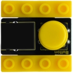                                 |
| 3  | Kidsbits 7-color Flashing LED Module | 1   | 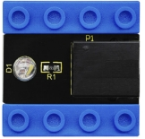                                 |
| 4  | Kidsbits Photoresistor               | 1   | 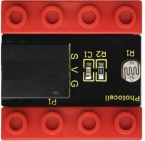                                 |
| 5  | Kidsbits PIR Motion Sensor           | 1   | 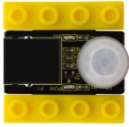                                 |
| 6  | AM/BM Blue USB Cable                 | 1   | 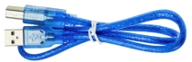                                 |
| 7  | AM/MK5P Black USB Cable              | 1   | 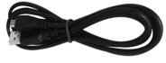                                 |
| 8  | 200mm Blue RJ11 Cable                | 4   |                                  |

# Get Started with Arduino

1.  **Installing Arduino IDE**

When you get control board, you need to download Arduino IDE and driver firstly.

You could download Arduino IDE from the official website:

<https://www.arduino.cc/>, click the **SOFTWARE** on the browse bar,
click“DOWNLOADS” to enter download page, as shown below:

There are various versions of IDE for Arduino. Just download a version
compatible with your system. Here we will show you how to download and install
the windows version of Arduino IDE.

There are two versions of IDE for WINDOWS system. You can choose between the
installer (.exe) and the Zip file. For installer, it can be directly downloaded,
without the need of installing it manually. However, for Zip package, you will
need to install the driver manually.

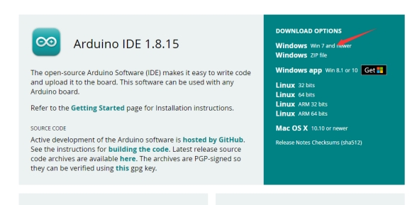

Click JUST DOWNLOAD.

1.  **The Control Board of Kidsbits**

This control board based on Arduino integrates ultrasonic and line-tracking
functions and boasts two passive buzzers to play music and an LED display

| Chip                    | ATMEGA328P-AU                                                                                        |
|-------------------------|------------------------------------------------------------------------------------------------------|
| Working Voltage         | 5V                                                                                                   |
| Working Current         |  Power by computer via USB cable or by power supply with output capacity greater than or equal to 2A |
| Maximum Power           | Maximum output power is 10W                                                                          |
| Working Temperature     | 0-50 degrees Celsius                                                                                 |
| Size                    | 77.5\*75mm                                                                                           |
| Environmental Attribute | ROHS                                                                                                 |

1.  **Install the Driver of the board**

Let’s install the driver of the main board.

The procedures to install the driver may have slight differences for different
systems. Here we will take Win7 system as as example to illustrate how to
install the driver.

The USB to serial port chip of this control board is CH340G. So you need to
install the driver for the chip. You can click the driver file here
[https://kd.kidsbits.cc/KD0003-Driver](../usb_ch341_3.1.2009.06.rar) to download
it.

In different systems, the driver installation is similar. Here we start to
install the driver on the Win7 system.

Plug one end of your USB cable into the square interface of the kidsbits coding
box and the other into a USB socket on your computer.

When you connect the kidsbits coding box to your computer at the first time,
right click your“Computer” —\>for “Properties”—\> click the “Device manager”,
under Other devices, you should see the “USB2.0-Serial”.

 Then right-click on
the USB2.0-Serial and select the top menu option (Update Driver Software...)
shown as the figure below.

Then it will be prompted to either“Search Automatically for updated driver
software or“Browse my computer for driver software”. Shown as below. In this
page, select“Browse my computer for driver software”.

After that, select the option to browse and navigate to the “drivers” folder of
usb-ch341 installation.

Once the software has been installed, you will get a confirmation message.
Installation completed, click“Close”.

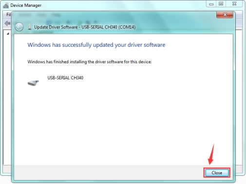

Up to now, the driver is installed well. Then you can right click“Computer”
—\>“Properties”—\>“Device manager”, you should see the device as the figure
shown below.

1.  **Arduino IDE Setting**

Clickicon，and open
Arduino IDE.

When downloading the sketch to the board, you must select the correct name of
Arduino board that matches the board connected to your computer. As shown below;

Then select the correct COM port (you can see the corresponding COM port after
the driver is successfully installed)

The functions of these symbols are demonstrated below.

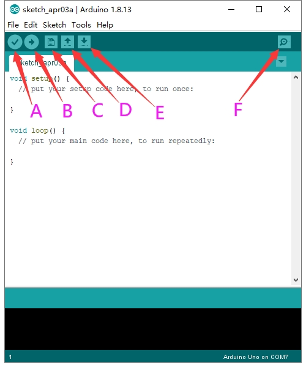

A- Used to verify whether there is any compiling mistakes or not.

B- Used to upload the sketch to your Arduino board.

C- Used to create shortcut window of a new sketch.

D- Used to directly open an example sketch.

E- Used to save the sketch.

F- Used to send the serial data received from board to the serial monitor.

**(5)Start First Program**

Open the file to select Example, and click BASICS→BLINK, as shown below:

Set the correct COM port, and the corresponding board and COM port are shown on
the lower right of IDE.

Clickto start compiling the
program, and check errors.

Clickto upload the program

After the program is uploaded successfully, the onboard LED blinks.
Congratulation, you have finished the first program.

**6.Add project Libraries**

**(1)What are Libraries ?**

[Libraries](https://www.arduino.cc/en/Reference/Libraries) are a collection of
code that makes it easy for you to connect to a sensor,display, module, etc.

For example, the built-in LiquidCrystal library helps talk to LCD displays.
There are hundreds of additional libraries available on the Internet for
download.

The built-in libraries and some of these additional libraries are listed in the
reference.

**(2)How to Install a Library ?**

Here we will introduce the most simple way for you to add libraries .

**Step 1：**After downloading well the Arduino IDE, you can right-click the icon
of Arduino IDE.

Find the option "Open file location" shown as below:

**Step 2:** Enter it to find out libraries folder, this folder is the library
file of Arduino.

**Step 3：** Next to find out the“libraries”folder of the yellow robot(seen in
the link: <https://kd.kidsbits.cc/KD0003>), you just need to replicate and paste
it into the libraries folder of Arduino IDE.

Then the libraries of yellow robot are installed successfully, as shown below:

**7. Projects：**

The whole project begins with basic programs. By assembling the robot car, you
will absorb the knowledge of electronics and machinery step by step. I reckon
that you can hardly sit still and itch to have a go now. Let’s get started.

Project 1: Blinking LED

1.  Introduction：

For starters and enthusiasts, LED Blink is a fundamental program.

LED, the abbreviation of light emitting diodes, consists of Ga, As, P, N
chemical compound and so on. The LED can flash diverse color by altering the
delay time in the test code. In the circuit, power on GND and VCC, the LED will
be on if S end is high level; nevertheless, it will go off.

In the experiment, we make the LED module blink through the test code.

**(2) Specification**：

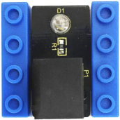

-   Control interface: digital port

-   Working voltage: DC 3.3-5V

-   Port: EASY plug

-   LED display color: seven colors

(3) Connection Diagram

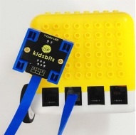

This Kidsbits programming blocks LED module is compatible with LEGO blocks and
the yellow robot. To wire up easily, we adapt the EASY plug to hinder the
reverse wiring-up. As shown below, we connect the LED module to the digital port
12(D12)

1.  Test Code：

int led=12; //set to digital port

void setup()

{

pinMode(led, OUTPUT); //set led to OUTPUT

}

void loop()

{

digitalWrite(led,HIGH); //led outputs high levels, LED on

delay(500); //delay in 500ms

digitalWrite(led,LOW); //led outputs low levels, LED off

delay(500);

}

1.  Test Result：

Upload the code, the LED connected to D12 blinks circularly, with an interval of
500ms.

**(6) Code Explanation**：

int led=12; define as the digital port

pinMode(led, OUTPUT): This function can denote that the pin is INPUT or OUTPUT

digitalWrite(led，HIGH): When pins are seen as OUTPUT, set it to HIGH(output 5V)
or LOW(output 0V)

delay(500); a delay function, 500 is the delay time, unit is ms

(7) Extension Practice：

We have succeeded in blinking LED. Next, let’s observe what will happen to the
LED if we modify pins and delay time.

int led=12; //set to digital port

void setup()

{

pinMode(led, OUTPUT); //set led to OUTPUT

}

void loop()

{

digitalWrite(led,HIGH); // led outputs high levels, LED on

delay(100); //delay in 100ms

digitalWrite(led,LOW); //led outputs low levels, LED off

delay(100);

}

The test result shows that the LED flashes faster. Therefore, we can draw a
conclusion that pins and time delaying affect flash frequency.

## Project 2: Playing Music

1.  **Introduction：**

We can use Arduino to make many interactive works, of which the most commonly
used is acoustic-optic display.

The buzzer we introduced here is a passive buzzer. It cannot be actuated by
itself, but by external pulse frequencies. The passive buzzer doesn’t carry with
vibrator inside, so it need external sine or square wave to drive. It can
produce slight sound when connecting directly to power supply. It features
controlling sound frequency and producing the sound of“do re mi fa so la si”.

1.  Passive Buzzer：

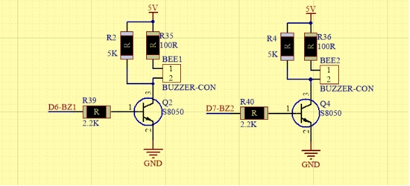

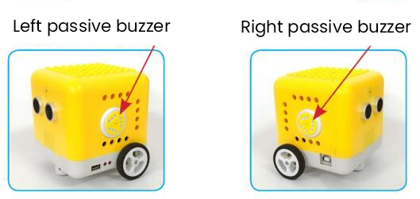

**2.1 Advantages：**

-   Low cost

-   the sound frequency is high

-   In some experiments, passive buzzer and LED can use a IO port jointly.

**2.2 How to use passive buzzer**

Passive buzzer is controlled by PWM pulse width rather than tones.

PWM is a means of controlling the analog output via digital means. Digital
control is used to generate square waves with different duty cycles (a signal
that constantly switches between high and low levels) to control the analog
output.In general, the input voltages of ports are 0V and 5V.

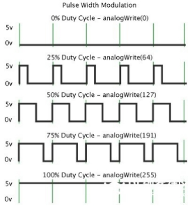

In the above figure, the green line represents a period, and value of
analogWrite() corresponds to a percentage which is called Duty Cycle as well.
Duty cycle implies that high-level duration is divided by low-level duration in
a cycle. From top to bottom, the duty cycle of first square wave is 0% and its
corresponding value is 0. The LED brightness is lowest, that is, light off. The
more time the high level lasts, the brighter the LED. Therefore, the last duty
cycle is 100%, which correspond to 255, and LED is the brightest. And 25% means
darker.

PWM mostly is used for adjusting the LED’s brightness or the rotation speed of
motors or the frequency of passive buzzer.

Beats are the time delay for each note. The larger the number, the longer the
delay time. A note without a line in the spectrum is a beat, with a delay of
1000 milliseconds. while a beat with an underline is 1/2 of a beat without a
line, and a beat with two underlines is 1/4 of a beat without a line.

**Preparation:**

1.  Slide the Bluetooth switch under the yellow robot to OFF end

2.  Interface the yellow robot with a computer via a USB cable.

3.  Upload the code to Arduino IDE

**3. Test Code：**

Turn off the Bluetooth switch before uploading the code.

void setup(){

pinMode(6, OUTPUT);

}

void loop(){

tone(6,392);

delay(125);

tone(6,392);

delay(125);

tone(6,440);

delay(250);

tone(6,392);

delay(250);

tone(6,532);

delay(250);

tone(6,494);

delay(500);

tone(6,392);

delay(125);

tone(6,392);

delay(125);

tone(6,440);

delay(250);

tone(6,392);

delay(250);

tone(6,587);

delay(250);

tone(6,532);

delay(500);

tone(6,392);

delay(125);

tone(6,392);

delay(125);

tone(6,784);

delay(250);

tone(6,659);

delay(250);

tone(6,532);

delay(250);

tone(6,494);

delay(250);

tone(6,440);

delay(250);

tone(6,392);

delay(125);

tone(6,392);

delay(125);

tone(6,330);

delay(250);

tone(6,262);

delay(250);

tone(6,587);

delay(250);

tone(6,532);

delay(500);

}

**4. Test Result：**

Upload the code to the yellow robot, you will hear the birthday song.

1.  **Code Explanation:**

There are two important factors in music: pitch and beat

Frequency is made of a series of pitch names in English letters and Numbers. You
can choose different frequencies, that is, tone. The frequency of sound is
called pitch.

It involves music knowledge. In music lesson, our teacher taught“1（Do）,
2（Re）, 3(Mi), 4(Fa) , 5(Sol), 6(La), 7(Si)”

| 1（Do） | 2（Re） | 3(Mi) | 4(Fa) | 5(Sol) | 6(La) | 7(Si) |
|---------|---------|-------|-------|--------|-------|-------|
| C       | D       | E     | F     | G      | A     | B     |

The number depends on high or low tone. The larger the number, the higher the
tone. When the number is same, the frequency (tone) is getting higher and higher
from C to \_B.

Beats are the time delay for each note. The larger the number, the longer the
delay time. A note without a line in the spectrum is a beat, with a delay of
1000 milliseconds. while a beat with an underline is 1/2 of a beat without a
line, and a beat with two underlines is 1/4 of a beat without a line.

（）

Here is the notation of Ode to Joy.

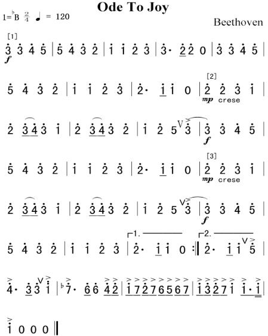

**Project 3: Birthday Gift**

**Introduction：**

Under the weak light，the yellow robot will play a birthday song and blink its
LED; however, it won’t play music and blink its LED under the strong light.
Light and music can vary with light intensity! In this project, we particularly
introduce the photoresistor module.

**Photoresistor**

This photoresistor sensor integrates the LEGO building block and Easy Plug port,
which can be fixed on the yellow robot flexibly. Only a blue cable needed can
interface it with the yellow robot. You are free from worries over reversely
wire up or damaging the module

This sensor is most sensitive to ambient light, generally used to detect the
brightness of the ambient light and trigger a single-chip or relay module, etc.

It mainly uses photoresistive elements and changes with light intensity. Under
the strong light, the resistance is 5-10KΩ; if there is no bright light, the
resistance is 0.2MΩ.

**Parameter：**

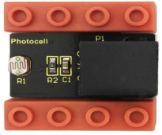

Port：EASY plug

Working Voltage：DC 5V

Output Signal：Analog signal

**Components：**

| Kidsbits Yellow  Robot \*1                                                       | Kidsbits Building Block LED Module \*1                                                | Kidsbits Building Block Photoresistor\*1                                    |
|----------------------------------------------------------------------------------|---------------------------------------------------------------------------------------|-----------------------------------------------------------------------------|
|  |  |  |

When the ambient light is weak, LED will flash and the yellow robot will play
songs

When the ambient light is strong, LED will be off and the robot won’t play
music.

And we need to detect the ambient light firstly. According to the detected
result, the light intensity value is between 700 and 750. Then we will continue
to measure.

When light intensity is between 700 and 750. When covering the photoresistor,
the detected value gets small. If the value is less than 700, robot will play
music.

If you the intensity is 750, LED will be off and robot won’t play music.

**Connection Diagram：**

Note: the LED module is interfaced with D12 and the photoresistor module is
connected to A6 port.

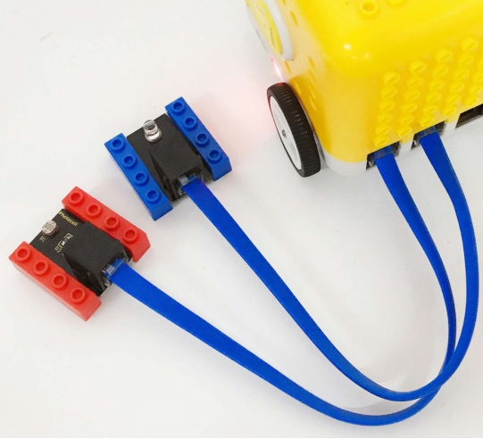

**Test Code：**

void setup(){

Serial.begin(9600); //Set baud rate to 9600

pinMode(6, OUTPUT); //Set A6 to OUTPUT

pinMode(12, OUTPUT); //set 12 to OUTPUT

}

void loop(){

Serial.println(analogRead(A6)); //read the analog value of A6

if (analogRead(A6) \< 700) { //determine if the analog value of A6 is less than
00

tone(6,392); //the analog value of A6 is 392

delay(125); //delay

tone(6,392);

digitalWrite(12,HIGH); //digital 12 outputs high levels

delay(125);

tone(6,440);

digitalWrite(12,LOW); //digital 12 outputs low levels

delay(250);

tone(6,392);

digitalWrite(12,HIGH);

delay(250);

tone(6,532);

digitalWrite(12,LOW);

delay(250);

tone(6,494);

delay(500);

tone(6,392);

digitalWrite(12,HIGH);

delay(125);

tone(6,392);

delay(125);

tone(6,440);

digitalWrite(12,LOW);

delay(250);

tone(6,392);

digitalWrite(12,HIGH);

delay(250);

tone(6,587);

digitalWrite(12,LOW);

delay(250);

tone(6,532);

delay(500);

tone(6,392);

digitalWrite(12,HIGH);

delay(125);

tone(6,392);

delay(125);

tone(6,784);

digitalWrite(12,LOW);

delay(250);

tone(6,659);

delay(250);

tone(6,532);

delay(250);

tone(6,494);

digitalWrite(12,HIGH);

delay(250);

tone(6,440);

delay(250);

tone(6,392);

delay(125);

digitalWrite(12,LOW);

tone(6,392);

delay(125);

tone(6,330);

delay(250);

tone(6,262);

digitalWrite(12,HIGH);

delay(250);

tone(6,587);

delay(250);

tone(6,532);

delay(500);

noTone(6);

digitalWrite(12,LOW);

}

if (analogRead(A6) \> 750) {

digitalWrite(12,LOW);

noTone(6);

}

}

1.  **Test Result：**

Upload code. Under the weak light, the robot will blink its LED and play song;
however, under the strong light, it won’t take a reaction.

1.  **Code Explanation：**

**Serial.begin(9600)**-initialize the serial port, and the serial port rate is
9600

**pinMode-** define the mode of Pin as output or input

**delay(500)-delay function;** 500 is delay time, you can set delay time.

## Project 4: Distance Detector

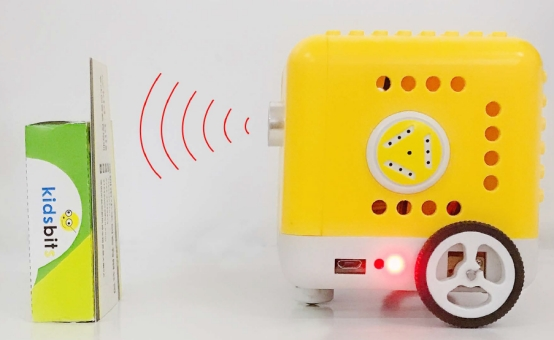

**Description：**

You may find that when we reverse a car, the alarm system will be triggered if
the car is going to hit the obstacle behind. This is because the car has
installed a safety device, the reversing radar which can detect the distance
between the car and objects behind.

In this lesson, we will learn how to make such a distance measuring device with
an ultrasonic sensor and a buzzer. Since we have illustrated buzzer in previous
project, here we will focus on the ultrasonic sensor.

**Ultrasonic Module**

An
ultrasonic sensor uses a sonar to determine the distance from the object like
what bats do. And it boasts a complete transmitting module and a receiving
module. Thus it can provide a non-contact distance measurement with high
accuracy and stable readings.

Ultrasonic sensors have found wide applications in all sorts of electronic
projects, such as obstacle detection and distance measurement. This project will
concentrate on how to use the ultrasonic sensor to detect distance.

**Working principle：**

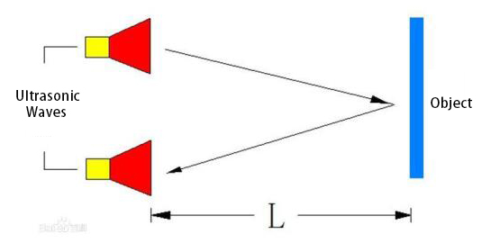

The ultrasonic sensor is shaped like two eyes, of which one serves as the
transmitting end and the other the receiving end.

It detects the time (t) gap between emitting signals and receiving them. And the
propagation speed of sound in the air is about 343m/s, and distance = speed \*
time. However, the ultrasonic wave emits and comes back, which is 2 times of
distance. Therefore, it needs to be divided by 2, the distance measured by
ultrasonic wave = (speed \* time)/2.

1.  Usage and timing chart of ultrasonic module:

1.  Setting the delay time of Trig pin of SR04 to 10μs at least, which can
    trigger it to detect distance.

2.  After triggering, the module will automatically send eight 40KHz ultrasonic
    pulses and detect whether there is a signal return. This step will be
    completed automatically by the module.

3.  If the signal returns, the Echo pin will output a high level, and the
    duration of the high level is the time from the transmission of the
    ultrasonic wave to the return.

| 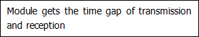 |
|-------------------------------------------------------------------------------------------------------------------------------------------------------------------------------------------------------------------------------------------------------------------------------------------------------------------------------------------------------------------------------------------------------------|

**Parameters：**

Power supply: +5V DC

Quiescent current: \<2mA

Working current: 15mA

Effective angle: \<15°

Measuring distance: 2 cm to 40 cm

Resolution: 0.3 cm

Measuring angle: 30 degrees

Trigger input pulse width: 10uS

**Preparations**

A.Turn the Bluetooth dial switch to OFF .

B.Connect the yellow car and the computer via a USB cable.

C.Compile and upload the test code through Arduino IDE.

**Test Code：**

volatile int distance;

float checkdistance_2_3() {

digitalWrite(2, LOW);

delayMicroseconds(2);

digitalWrite(2, HIGH);

delayMicroseconds(10);

digitalWrite(2, LOW);

float distance = pulseIn(3, HIGH) / 58.00;

delay(10);

return distance;

}

void setup(){

Serial.begin(9600);

distance = 0;

pinMode(2, OUTPUT);

pinMode(3, INPUT);

pinMode(6, OUTPUT);

pinMode(7, OUTPUT);

}

void loop(){

distance = checkdistance_2_3();

Serial.println(distance);

if (distance \> 0 && distance \< 8) {

tone(6,532);

tone(7,532);

delay(250);

noTone(6);

noTone(7);

delay(250);

tone(6,532);

tone(7,532);

delay(250);

noTone(6);

noTone(7);

delay(1000);

}

}

**Test Results：**

Upload the above test code, the yellow robot will emit“tick,tick”when detecting
the obstacle away from 0cm to 8cm.

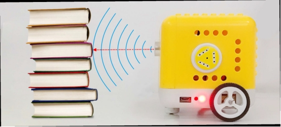

Project 5: Button Counter

**Description：**

In daily life, we usually need to count numbers. In this project, we will make a
button counter.

**Button Module：**

This button module integrates the LEGO building block and Easy Plug port, which
can be fixed on the yellow robot flexibly. Only a blue cable needed can
interface it with the yellow robot. You are free from worries over reversely
wire up or damaging the module

When we press it, low level signals will be output; when it is released, high
level signals will be output

**Parameter**

Interface: EASY plug

Working voltage: DC 5V

Output signal: digital signal

**Connection Diagram：**

Use the blue cable to connect the button module to D12 port of the yellow robot

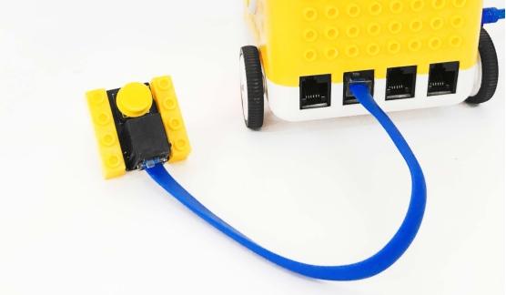

**Preparation**

Slide the BT switch to OFF end

Connect the yellow robot to the computer by a USB cable

Connect the button module to D12 through a blue cable

Upload test code on Arduino IDE

**Test Code：**

volatile int num; //define as num

void setup(){

num = 0; //set num to 0

Serial.begin(9600); //set baud rate to 9600

pinMode(12, INPUT); //set digital 12 to INPUT

}

void loop(){

if (digitalRead(12) == 0) { //if digital 12 is low level or not delay(10);
//delay in 10ms to stop the button from shaking

if (digitalRead(12) == 0) {

delay(200);

if (digitalRead(12) == 1) { //if digital 12 is equal to high level or not

delay(10); //delay in 10ms to stop the button from shaking

if (digitalRead(12) == 1) {

num = num + 1; //display how many times the button is pressed

Serial.println(num); //display how many times the button is pressed

}

}

}

}

}

**Test Result：**

Upload code to the yellow robot, open serial monitor and press the button. You
will see the data as follows:

**Code Explanation:**

When you press or release button, different digital signals will be output due
to the shaking of the button. To eliminate shaking, we need to delay time. In
this chapter, we delay in 10ms

## Project 6: Motor

**Introduction:**

DC reduction motor, also called gear reduction motor, is developed on the
ordinary DC motor. It has a matching gear reduction box which provides a lower
speed but a larger torque. Furthermore, different reduction ratios of the box
can provide different speeds and torques.

**Parameters:**

Rated voltage: 6.0V DC

Operating voltage: 1.0V \~ 6.0V DC

Rated load: torque plate load 0.5kg-cm

Rotation direction: clockwise or counterclockwise when viewed from the shaft
extension

Motor posture: all directions of output shaft

Operating temperature: -10℃\~+60℃

Storage temperature: -20℃\~+85℃

**Description of chip:**

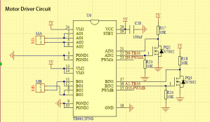

A motor driver is a chip integrated with CMOS control circuit and power DMOS
device. It can be used to form a complete motion control system with the main
processor, motor and incremental encoder. It can be applied to drive inductive
loads such as DC motors, stepping motors and relays. What’s more, it can control
the DC reduction motor to rotate clockwise or anticlockwise.

The yellow car introduced in this course uses the TB6612FNG motor drive chip,
which is a device driving DC motors. Compared with the traditional L298N, the
module has a much higher efficiency and a significant reduction in size. Within
the rated range, the chip basically does not generate heat.

It has a high-current MOSFET-H bridge structure and dual-channel circuit output
so it can drive 2 motors at the same time. TB6612FNG can output continuous drive
current up to 1.2 A per channel, and it boasts four motor control modes: rotate
clockwise, rotate anticlockwise, brake and stop.

**Working Principle**

The DC reduction motor on the left side of the yellow car has two pins which are
connected to the digital pin 8 and pin 9 (a PMW pin)controlling the rotation
direction and the speed respectively.(This PMW pin can not only output high and
low level stably but make constant changes in high and low levels within a given
time so as to control the speed of the motor. It can output values from 0-255 of
which 255 represents high level while 0 implies low level.)

| Its Left Wheel |                      |                      |
|----------------|----------------------|----------------------|
| Digital Pin 8  | Digital Pin 9（PWM） | DC Reduction Motor   |
| Low Level      | 0                    | Stop                 |
| Low Level      | 200                  | Rotate anticlockwise |
| High Level     | 200                  | Rotate clockwise     |
| High Level     | 0                    | Stop                 |

The DC reduction motor on the right side of the car also has two pins, one of
which is connected to the analog pin A1 (also the digital pin 15) to control
directions and the other is linked with digital pin 10 to adjust speed. Please
note that analog pins can function like digital pins while digital pins can not
be taken as analog ones.

| Its Right Wheel |                       |                      |
|-----------------|-----------------------|----------------------|
| Digital Pin A1  | Digital Pin 10（PWM） | DC Reduction Motor   |
| Low Level       | 0                     | Stop                 |
| Low Level       | 200                   | Rotate clockwise     |
| High Level      | 200                   | Rotate anticlockwise |
| High Level      | 0                     | Stop                 |

**Test Code：**

void setup(){

pinMode(8, OUTPUT);

pinMode(A1, OUTPUT);

}

void loop(){

//Move forward

digitalWrite(8,LOW);

digitalWrite(A1,LOW);

analogWrite(9,200);

analogWrite(10,201);

delay(3000);

//Move backwards

digitalWrite(8,HIGH);

digitalWrite(A1,HIGH);

analogWrite(9,196);

analogWrite(10,200);

delay(3000);

//Stop

digitalWrite(8,HIGH);

digitalWrite(A1,HIGH);

analogWrite(9,0);

analogWrite(10,0);

delay(3000);

//Turn left

digitalWrite(8,HIGH);

digitalWrite(A1,LOW);

analogWrite(9,100);

analogWrite(10,100);

delay(2000);

//Turn right

digitalWrite(8,LOW);

digitalWrite(A1,HIGH);

analogWrite(9,100);

analogWrite(10,100);

delay(2000);

}

**Test Results：**

The car will move forward in 3s, then go backwards in 3s, stop in 3s, and turn
left in 3s and then right in 3s and repeat this pattern.

**Code Explanation：**

**digitalWrite(8,LOW);** The control of directions (move anticlockwise or
clockwise)is realized by the changes in high and low levels and digital pins are
enough for this to happen.

**analogWrite(9,200);**The adjustment of speed is realized by PMW and it relies
on the PMW pin of Arduino to make this possible.

**Extension Project：**

Now,let’s control the speed of the motor by PMW.

void setup(){

pinMode(8, OUTPUT);

pinMode(A1, OUTPUT);

}

void loop(){

//Move forward

digitalWrite(8,LOW);

digitalWrite(A1,LOW);

analogWrite(9,200);

analogWrite(10,200);

delay(3000);

//Move backwards

digitalWrite(8,HIGH);

digitalWrite(A1,HIGH);

analogWrite(9,194);

analogWrite(10,200);

delay(3000);

//Stop

digitalWrite(8,HIGH);

digitalWrite(A1,HIGH);

analogWrite(9,0);

analogWrite(10,0);

delay(3000);

//Turn left

digitalWrite(8,HIGH);

digitalWrite(A1,LOW);

analogWrite(9,120);

analogWrite(10,120);

delay(2000);

//Turn right

digitalWrite(8,LOW);

digitalWrite(A1,HIGH);

analogWrite(9,120);

analogWrite(10,120);

delay(2000);

}

//\*\*\*\*\*\*\*\*\*\*\*\*\*\*\*\*\*\*\*\*\*\*\*\*\*\*\*\*\*\*\*\*\*\*\*\*\*\*\*\*\*\*\*\*\*\*\*\*\*\*\*\*\*\*\*\*\*\*\*\*\*\*\*\*\*\*\*\*\*\*\*

The motor will slow down when the code is uploaded.

Project 7: 8\*8 Dot Matrix Dispaly

**Description：**

We add an LED panel displaying numerous pictures to a robot. In fact, this panel
is called 8\*8 dot matrix display. It comes with 64 LEDs, of which can be lit
separately or together. Different lit areas can foster distinct pictures

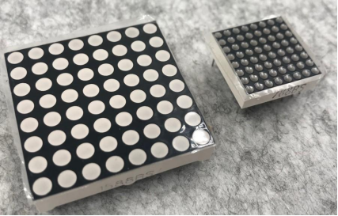**8\*8 Dot Matrix**

Composed of LED emitting tube diodes, LED dot matrix are applied widely to
public information display like advertisement screen and bulletin board, by
controlling LED to show words, pictures and videos, etc.

Divided into single-color, double-color, and three-color lights according to
emitting color , LED dot matrix could show red, yellow, green and even true
color.

There are different types of matrices, including 4×4, 8×8 and 16×16 and etc.

The 8×8 dot matrix contains 64 LEDs.

The inner structure of 8×8 dot matrix is shown below.

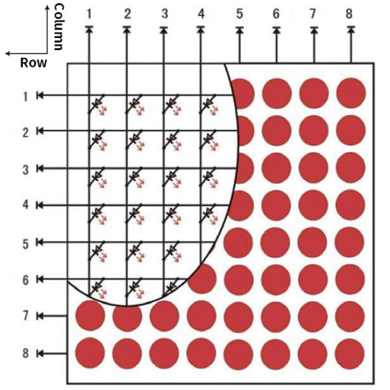

Every LED is installed on the cross point of row line and column line. When the
voltage on a row line increases, and the voltage on the column line reduces, the
LED on the cross point will light up. 8×8 dot matrix has 16 pins. Put the
silk-screened side down and the numbers are 1,8, 9 and 16 in anticlockwise order
as marked below.

The definition inner pins are shown below:

For instance, to light up the LED on row 1 and column 1, you should increase the
voltage of pin 9 and reduce the voltage of pin 13.

**HT16K33 8X8 Dot Matrix**

The HT16K33 is a memory mapping and multi-purpose LED controller driver. The
max. Display segment numbers in the device is 128 patterns (16 segments and 8
commons) with a 13\*3 (MAX.) matrix key scan circuit. The software configuration
features of the HT16K33 makes it suitable for multiple LED applications
including LED modules and display subsystems. The HT16K33 is compatible with
most microcontrollers and communicates via a two-line bidirectional I2C-bus.

The picture below is the working schematic of HT16K33 chip

We design the drive module of 8\*8 dot matrix based on the above principle. We
could control the dot matrix by I2C communication and two pins of
microcontroller, according to the above diagram.

**Specification of 8\*8 dot matrix**

Input voltage: 5V

Rated input frequency: 400KHZ

Input power: 2.5W

Input current: 500mA

4\. Introduction for Modulus Tool

The online version of dot matrix modulus tool:

[http://dotmatrixtool.com/\#](http://dotmatrixtool.com/)

① Open the link to enter the following page.

② The dot matrix is 8\*8 in this project, so set the height to 8, width to 8, as
shown below.

Click Byte order to select“**Row major”**

③ Generate hexadecimal data from the pattern

As shown below, the left button of the mouse is for selection while the right is
for canceling. Thus you could use them to draw the pattern you want, then click
**Generate**, to yield the hexadecimal data needed.

The generated hexadecimal code(0x00, 0x66, 0x00, 0x00, 0x18, 0x42, 0x3c, 0x00)
is what will be displayed, so you need to save it for next procedure.

**Preparation**

Slide the BT switch to OFF end

Connect the yellow robot to the computer by a USB cableUpload test code on
Arduino IDE

**Test Code：**

Code 1：

\#include \<Matrix.h\>

Matrix myMatrix(A4,A5); //create myMatrix and define communication pin

void setup(){

myMatrix.begin(0x70);

}

void loop(){

myMatrix.clear();

myMatrix.drawStr("hello!");

}

Upload the above code, the yellow robot shows“hello!”

Code 2：

\#include \<Matrix.h\>

Matrix myMatrix(A4,A5); //create myMatrix and define communication pin

uint8_t LedArray1[8]={0xff,0x81,0xbd,0xa5,0xa5,0xbd,0x81,0xff};

uint8_t LEDArray[8];

void setup(){

myMatrix.begin(0x70);

}

void loop(){

myMatrix.clear();

for(int i=0; i\<8; i++)

{

LEDArray[i]=LedArray1[i];

for(int j=7; j\>=0; j--)

{

if((LEDArray[i]&0x01)\>0)

myMatrix.drawPixel(j, i,1);

LEDArray[i] = LEDArray[i]\>\>1;

}

}

myMatrix.writeDisplay();

}

Upload the above code, the yellow robot displays a concentric square,

Code 3：

\#include \<Matrix.h\>

Matrix myMatrix(A4,A5); // //create myMatrix and define communication pins

uint8_t LedArray1[8]={0x18,0x18,0x18,0x18,0x99,0x5a,0x3c,0x18};

uint8_t LEDArray[8]; //define a array variable without initial value

uint8_t LedArray2[8]={0x10,0x20,0x40,0xff,0xff,0x40,0x20,0x10};

uint8_t LedArray3[8]={0x18,0x3c,0x5a,0x99,0x18,0x18,0x18,0x18};

uint8_t LedArray4[8]={0x08,0x04,0x02,0xff,0xff,0x02,0x04,0x08};

uint8_t LedArray5[8]={0x00,0x18,0x24,0x00,0x00,0xa5,0xa5,0x42};

void setup(){

myMatrix.begin(0x70);

}

void loop(){

myMatrix.clear();

for(int i=0; i\<8; i++)

{

LEDArray[i]=LedArray1[i];

for(int j=7; j\>=0; j--)

{

if((LEDArray[i]&0x01)\>0)

myMatrix.drawPixel(j, i,1); //Light the corresponding point

LEDArray[i] = LEDArray[i]\>\>1;

}

}

myMatrix.writeDisplay();

delay(1000);

myMatrix.clear();

myMatrix.writeDisplay();

for(int i=0; i\<8; i++)

{

LEDArray[i]=LedArray2[i];

for(int j=7; j\>=0; j--)

{

if((LEDArray[i]&0x01)\>0)

myMatrix.drawPixel(j, i,1);

LEDArray[i] = LEDArray[i]\>\>1;

}

}

myMatrix.writeDisplay();

delay(1000);

myMatrix.clear();

myMatrix.writeDisplay();

for(int i=0; i\<8; i++)

{

LEDArray[i]=LedArray3[i];

for(int j=7; j\>=0; j--)

{

if((LEDArray[i]&0x01)\>0)

myMatrix.drawPixel(j, i,1);

LEDArray[i] = LEDArray[i]\>\>1;

}

}

myMatrix.writeDisplay();

delay(1000);

myMatrix.clear();

myMatrix.writeDisplay();

for(int i=0; i\<8; i++)

{

LEDArray[i]=LedArray4[i];

for(int j=7; j\>=0; j--)

{

if((LEDArray[i]&0x01)\>0)

myMatrix.drawPixel(j, i,1);

LEDArray[i] = LEDArray[i]\>\>1;

}

}

myMatrix.writeDisplay();

delay(1000);

myMatrix.clear();

myMatrix.writeDisplay();

for(int i=0; i\<8; i++)

{

LEDArray[i]=LedArray5[i];

for(int j=7; j\>=0; j--)

{

if((LEDArray[i]&0x01)\>0)

myMatrix.drawPixel(j, i,1);

LEDArray[i] = LEDArray[i]\>\>1;

}

}

myMatrix.writeDisplay();

delay(1000);

myMatrix.clear();

myMatrix.writeDisplay();

}

Upload code, the yellow robot will show arrow up,down, leftward and rightward
and smile image, circularly.

Project 8: Obstacle Avoidance Robot

**Description：**

We have learned about distance detection and motor drive. In this lesson, we
combine them together. In fact, we only need to change a test code to convert
the car into an obstacle avoidance car.

| detection       | Distance away from the left obstacle  | Distance1（unit：cm） |
|-----------------|---------------------------------------|-----------------------|
|                 | Distance away from the right obstacle | Distance2（unit：cm） |
|                 | Distance away from the front obstacle | distance（unit：cm）  |
| Condition       | Status                                |                       |
| 0\<distance\<15 | Distance1\> distance2                 | Turn left             |
|                 | Distance1\<=distance2                 | Turn right            |
| distance\>=15   | Go forward                            |                       |

**Preparation**

Slide the BT switch to OFF end

Connect the yellow robot to the computer by a USB cable

Upload test code on Arduino IDE

Test Code：

Pin Trig (trigger signal input) and pin Echo are connected to digital 2 and 3 of
the yellow robot.

volatile int distance;

volatile int distance1;

volatile int distance2;

void Stop() { //stop

digitalWrite(8,HIGH);

pinMode(A1, OUTPUT);

digitalWrite(A1,HIGH);

analogWrite(9,0);

analogWrite(10,0);

}

void left() { //turn left

digitalWrite(8,HIGH);

pinMode(A1, OUTPUT);

digitalWrite(A1,LOW);

analogWrite(9,120);

analogWrite(10,120);

}

float checkdistance_2_3() { //ultrasonic ranging

digitalWrite(2, LOW); //Set pin 2 to low level

delayMicroseconds(2); //delay in 2ms

digitalWrite(2, HIGH); //Set pin 2 to high level

delayMicroseconds(10); //delay in 10ms

digitalWrite(2, LOW);

float distance = pulseIn(3, HIGH) / 58.00; //calculate distance

delay(10);

return distance;

}

void back() { //go back

digitalWrite(8,HIGH);

pinMode(A1, OUTPUT);

digitalWrite(A1,HIGH);

analogWrite(9,150);

analogWrite(10,150);

}

void buzzer() { //the code of buzzer

tone(6,532);

tone(7,532);

delay(250);

noTone(6);

noTone(7);

delay(250);

tone(6,532);

tone(7,532);

delay(250);

noTone(6);

noTone(7);

delay(1000);

}

void front() { //go forward

digitalWrite(8,LOW);

pinMode(A1, OUTPUT);

digitalWrite(A1,LOW);

analogWrite(9,150);

analogWrite(10,150);

}

void right() { //turn right

digitalWrite(8,LOW);

pinMode(A1, OUTPUT);

digitalWrite(A1,HIGH);

analogWrite(9,120);

analogWrite(10,120);

}

void setup(){

Serial.begin(9600);

distance = 0;

distance1 = 0;

distance2 = 0;

pinMode(8, OUTPUT);

pinMode(2, OUTPUT);

pinMode(3, INPUT);

pinMode(6, OUTPUT);

pinMode(7, OUTPUT);

}

void loop(){

distance = checkdistance_2_3(); //define distance value as distance

if (distance \< 15) { //determine the distance is less than 15cm or not

Stop();

buzzer();

delay(1000);

left();

delay(380);

Stop();

distance1 = checkdistance_2_3();

delay(1000);

right();

delay(750);

Stop();

distance2 = checkdistance_2_3();

delay(1000);

if (distance1 \> distance2) {

left();

delay(750);

front();

} else {

front();

}

} else {

front();

}

}

**Test Result：**

If the obstacle distance is more than and equal to 15cm, the car will go
forward. If less than 15cm, the car will stop and play "tick,tick"

sound. If the left obstacle distance is greater than the right distance, the car
will turn left. On the contrary, it will turn right.

Project 9: Line Tracking Smart Car

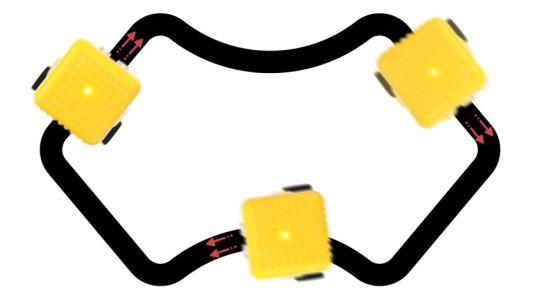

**Description**

The previous projects are inclusive of the knowledge of multiple sensors and
modules. Next, we will work on a little challenging task.

Based on the working principle of the line tracking sensor we could make a line
tracking car.

The tracking sensor is actually an infrared sensor. Its working principle is to
convert the intensity of the reflected signal into a current signal. During the
detection process, black color is active at high level and white is active at
low level. Its detection height is 0- 1cm. In the project, we detect the status
of the tracking sensor, then analyze and compare the data obtained, and then
control the rotation of the two sets of motors according to certain logic, so as
to control the yellow robot.

**Flow Chart：**

| Detection                                                               | Left tracking sensor        | detects black line：LOW  |
|-------------------------------------------------------------------------|-----------------------------|--------------------------|
|                                                                         |                             | detects white line：HIGH |
|                                                                         | Right tracking sensor       | detects black line：LOW  |
|                                                                         |                             | detects white line：HIGH |
| Condition                                                               | Status                      |                          |
| Two sensors detect black line                                           | Go forward                  |                          |
| Left sensor detects white line and right one detects the black line     | Turn right (set PWM to 100) |                          |
| left sensor detects the black line and the right one detects white line | Turn left (set PWM to100)   |                          |
| Two sensors don’t black line                                            | Stop                        |                          |

**Preparation**

Slide the BT switch to OFF end

Connect the yellow robot to the computer by a USB cable（3）Upload test code on
Arduino IDE

**Test Code：**

\#include \<Matrix.h\>

Matrix myMatrix(A4,A5);

uint8_t LedArray1[8]={0xff,0x81,0xbd,0xa5,0xa5,0xbd,0x81,0xff};

//Array, used to store the data of pattern, can be calculated by yourself or
obtained from the modulus tool

uint8_t LEDArray[8];

void left() { //the status of left turning

digitalWrite(8,HIGH); //left motor rotates anticlockwise

digitalWrite(A1,LOW); //right motor rotates clockwise

analogWrite(9,100); //set the speed of the left motor to 100

analogWrite(10,100); //set the speed of the right motor to 100

}

void Stop() { //stop status

digitalWrite(8,HIGH); //left motor rotates anticlockwise

digitalWrite(A1,HIGH); //right motor rotates clockwise

analogWrite(9,0); //set the speed of the left motor to 0

analogWrite(10,0); //set the speed of the right motor to 0

}

void right() { //the status of right-turning

digitalWrite(8,LOW); //left motor rotates clockwise

digitalWrite(A1,HIGH); //right motor rotates anticlockwise

analogWrite(9,102); //set the speed of the left motor to 102

analogWrite(10,102); //set the speed of the right motor to 102

}

void front() { //the status of going forward

digitalWrite(8,LOW); //left motor rotates clockwise

digitalWrite(A1,LOW); //right motor rotates clockwise analogWrite(9,150); //set
the speed of the left motor to 150

analogWrite(10,150); //set the speed of the right motor to 150

}

void setup(){

Serial.begin(9600);

myMatrix.begin(0x70);

myMatrix.clear(); //clear screen

delay(1000); //delay

for(int i=0; i\<8; i++) //Every character has 8 bits

{

LEDArray[i]=LedArray1[i];

for(int j=7; j\>=0; j--) //Every character has 8 bits

{

if((LEDArray[i]&0x01)\>0) //

myMatrix.drawPixel(j, i,1);

LEDArray[i] = LEDArray[i]\>\>1; //detect bit by bit and make data move one bit
rightward

}

}

myMatrix.writeDisplay();

pinMode(8, OUTPUT);

pinMode(4, INPUT);

pinMode(5, INPUT);

pinMode(A1, OUTPUT);

}

void loop(){

Serial.println(digitalRead(4));

Serial.println(digitalRead(5));

if (digitalRead(4) == 0 && digitalRead(5) == 1) { //if only left sensor detects
the black line

left(); //robot turns left

} else if (digitalRead(4) == 1 && digitalRead(5) == 0) { //if only right sensor
detects the black line

right(); //smart robot turns right

} else if (digitalRead(4) == 1 && digitalRead(5) == 1) {//if the don’t detect
the black line

Stop(); //smart car stops

} else {

front();

}

}

**(4) Test Result：**

Upload the code, slide the switch to ON end. Then the yellow robot will follow
the black line.

Project 10: Magical Pattern

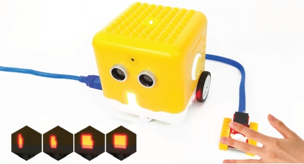

1.  **Description：**

We’ve introduced how to use the LED dot matrix and change pictures. In this
project, we will make dot matrix show different images through a PIR motion
sensor.

1.  **PIR Motion Sensor：**

This PIR motion sensor integrates the LEGO building block and Easy Plug port,
which can be fixed on the yellow robot flexibly. Only a blue cable needed can
interface it with the yellow robot. You are free from worries over reversely
wire up or damaging the module.

It can detect infrared signals of people or animals in motion, and output switch
signals. It also is highly sensitive and reliable with ultra-low power
consumption and ultra-low voltage working mode.

Additionally it can be applied to various automatic induction electrical
equipment, especially automatic control products powered by dry batteries.

**Parameter**

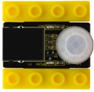

Interface: EASY plug

Working voltage: DC 3.3V\~5V

Working current: 15 uA

Output signal: digital signal

Output delay time (high level): about 2.3 \~ 3 seconds

Detection range: 0\~50cm

Detection angle: 100º.

**Special note：**

1\. When testing, first open the white lens, you can see the rectangular sensing
part. When the long line of the rectangular sensing part is parallel to the
ground, the distance is the best.

2\. When testing, the sensor needs to be covered with white lens, otherwise it
will affect the distance.

3\. The distance is best at 25℃, and the detection distance is shortened when it
exceeds 30℃.

4. Done powering up
and uploading the code, you need to wait 5-10 seconds then start testing,
otherwise it is not sensitive.

**Connection Diagram：**

Connect the PIR motion sensor to D12 of the yellow robot

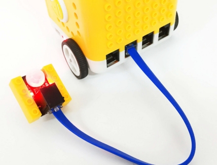

**Preparation**

Slide the BT switch to OFF end

Connect the yellow robot to the computer by a USB cable

Connect the PIR motion sensor to D12 of the yellow robot

Upload test code on Arduino IDE

**Test Code：**

\#include \<Matrix.h\>

Matrix myMatrix(A4,A5);

uint8_t LedArray1[8]={0xff,0x81,0x81,0x81,0x81,0x81,0x81,0xff};

uint8_t LEDArray[8];

uint8_t LedArray2[8]={0x00,0x7e,0x42,0x42,0x42,0x42,0x7e,0x00};

uint8_t LedArray3[8]={0x00,0x00,0x3c,0x24,0x24,0x3c,0x00,0x00};

uint8_t LedArray4[8]={0x00,0x00,0x00,0x18,0x18,0x00,0x00,0x00};

uint8_t LedArray5[8]={0x00,0x00,0x3c,0x24,0x24,0x3c,0x00,0x00};

uint8_t LedArray6[8]={0x00,0x7e,0x42,0x42,0x42,0x42,0x7e,0x00};

uint8_t LedArray7[8]={0xff,0x81,0x81,0x81,0x81,0x81,0x81,0xff};

//The square on the modulus tool gradually becomes smaller

void setup(){

Serial.begin(9600);

myMatrix.begin(0x70);

myMatrix.clear(); //Clear screen

pinMode(12, INPUT);

}

void loop(){

Serial.println(digitalRead(12));

if (digitalRead(12) == 1) { //if there is someone nearby myMatrix.clear();

myMatrix.writeDisplay();

for (int i = 0; i \<= 8; i = i + (1)) {

for (int j = 0; j \<= 8; j = j + (1)) {

myMatrix.drawPixel(i-1,j-1,1);

myMatrix.writeDisplay();

delay(100);

}

}

} else { //otherwise

for(int i=0; i\<8; i++)

{

LEDArray[i]=LedArray1[i];

for(int j=7; j\>=0; j--)

{

if((LEDArray[i]&0x01)\>0)

myMatrix.drawPixel(j, i,1);

LEDArray[i] = LEDArray[i]\>\>1;

}

}

myMatrix.writeDisplay();

delay(200);

myMatrix.clear();

myMatrix.writeDisplay();

for(int i=0; i\<8; i++)

{

LEDArray[i]=LedArray2[i];

for(int j=7; j\>=0; j--)

{

if((LEDArray[i]&0x01)\>0)

myMatrix.drawPixel(j, i,1);

LEDArray[i] = LEDArray[i]\>\>1;

}

}

myMatrix.writeDisplay();

delay(200);

myMatrix.clear();

myMatrix.writeDisplay();

for(int i=0; i\<8; i++)

{

LEDArray[i]=LedArray3[i];

for(int j=7; j\>=0; j--)

{

if((LEDArray[i]&0x01)\>0)

myMatrix.drawPixel(j, i,1);

LEDArray[i] = LEDArray[i]\>\>1;

}

}

myMatrix.writeDisplay();

delay(200);

myMatrix.clear();

myMatrix.writeDisplay();

for(int i=0; i\<8; i++)

{

LEDArray[i]=LedArray4[i];

for(int j=7; j\>=0; j--)

{

if((LEDArray[i]&0x01)\>0)

myMatrix.drawPixel(j, i,1);

LEDArray[i] = LEDArray[i]\>\>1;

}

}

myMatrix.writeDisplay();

delay(200);

myMatrix.clear();

myMatrix.writeDisplay();

for(int i=0; i\<8; i++)

{

LEDArray[i]=LedArray5[i];

for(int j=7; j\>=0; j--)

{

if((LEDArray[i]&0x01)\>0)

myMatrix.drawPixel(j, i,1);

LEDArray[i] = LEDArray[i]\>\>1;

}

}

myMatrix.writeDisplay();

delay(200);

myMatrix.clear();

myMatrix.writeDisplay();

for(int i=0; i\<8; i++)

{

LEDArray[i]=LedArray6[i];

for(int j=7; j\>=0; j--)

{

if((LEDArray[i]&0x01)\>0)

myMatrix.drawPixel(j, i,1);

LEDArray[i] = LEDArray[i]\>\>1;

}

}

myMatrix.writeDisplay();

delay(200);

myMatrix.clear();

myMatrix.writeDisplay();

for(int i=0; i\<8; i++)

{

LEDArray[i]=LedArray7[i];

for(int j=7; j\>=0; j--)

{

if((LEDArray[i]&0x01)\>0)

myMatrix.drawPixel(j, i,1);

LEDArray[i] = LEDArray[i]\>\>1;

}

}

myMatrix.writeDisplay();

delay(200);

myMatrix.clear();

myMatrix.writeDisplay();

}

}

**Test Result：**

Upload test code, the yellow robot will display lit LEDs gradually when
detecting people around. If nobody is nearby, it will convert from a big square
into a smaller one, circularly.

Project 11: Sound-controlled Smart Car

**Description：**

In this project. We will make the yellow robot perform sound control function
through sound sensor and ultrasonic sensor inside.

**Sound Sensor**

The sound sensor is a sensor that converts sound signals into electrical
signals. It can be used to make sound-activated robots, sound-activated
switches, sound-activated alarms, etc., according to the effect of interacting
with the sound.

There is a very thin film in the sensor. When sound or air blows it,

the sound wave or airflow passes through, the film will vibrate

Continuously and generate an electrical signal, which is transmitted to the
coding robot.

(Arduino Uno)

The sound intensity detected can be converted to any value between 0\~1023.

The Trig pin of the ultrasonic sensor is connected to digital 2 and Echo pin is
connected to digital 3; the sound sensor is interfaced with analog A0; SDA and
SCL pin of dot matrix display is attached to analog A4 and A5; and the pin
controlling direction on the left DC geared motor is connected to digital 8 and
its pin controlling speed is interfaced with digital 9; the pin controlling
direction on the right DC motor is attached to A1(digital 15) and the pin
controlling speed is interfaced with digital 10.

**Preparation**

Slide the BT switch to OFF end

Connect the yellow robot to the computer by a USB cable（3）Upload test code on
Arduino IDE

**Test Code：**

Note:

Need to fully charge the yellow robot if you continue further experiments.

Clap your hands or make sounds with 5cm away from sound sensor.

\#include \<Matrix.h\>

Matrix myMatrix(A4, A5); //create myMatrix and define communication pins

volatile int distance; //ultrasonic ranging variable

volatile int distance1;

volatile int distance2;

int sensorVal;

uint8_t LedArray1[8] = {0x00, 0x18, 0x24, 0x00, 0x00, 0xa5, 0xa5, 0x42};

uint8_t LEDArray[8]; //define a array variable without initial value

void front() { //go front

digitalWrite(8, LOW);

digitalWrite(A1, LOW);

analogWrite(9, 150);

analogWrite(10, 150);

}

void back() { //go back

digitalWrite(8, HIGH);

digitalWrite(A1, HIGH);

analogWrite(9, 150);

analogWrite(10, 150);

}

void Stop() { //stop

digitalWrite(8, HIGH);

digitalWrite(A1, HIGH);

analogWrite(9, 0);

analogWrite(10, 0);

}

float checkdistance_2_3() { //ultrasonic ranging code

digitalWrite(2, LOW);

delayMicroseconds(2);

digitalWrite(2, HIGH);

delayMicroseconds(10);

digitalWrite(2, LOW);

float distance = pulseIn(3, HIGH) / 58.00; //calculate distance

delay(10);

return distance;

}

void left() { //code of left turning

digitalWrite(8, HIGH);

digitalWrite(A1, LOW);

analogWrite(9, 140);

analogWrite(10, 140);

}

void right() { //the code of right turning

digitalWrite(8, LOW);

digitalWrite(A1, HIGH);

analogWrite(9, 140);

analogWrite(10, 140);

}

void avoid(){

distance = checkdistance_2_3(); //set the detected value to distance

if(distance \< 15&&distance \>0){

Stop(); //stop

left(); //turn left

delay(380); //delay in 380ms

Stop();

distance1 = checkdistance_2_3(); //set the detected value to distance1

delay(300); //delay in 300ms

right(); //turn right

delay(750); //delay in 750ms

Stop(); //stop

distance2 = checkdistance_2_3(); //set the detected value to distance2

delay(300);

if (distance1 \> distance2) { //if left distance value is more than the right
one

left();

delay(750);

front();

}else{

front();

}

}

else{

front();

}

}

void setup() {

Serial.begin(9600);

pinMode(8, OUTPUT); //define pin8 as OUTPUT

pinMode(A1, OUTPUT);

pinMode(2, OUTPUT);

pinMode(3, INPUT); //define pin3 as INPUT

distance = 0;

distance1 = 0;

distance2 = 0;

myMatrix.begin(0x70);

myMatrix.clear();

delay(1000);

for (int i = 0; i \< 8; i++)

{

LEDArray[i] = LedArray1[i];

for (int j = 7; j \>= 0; j--)

{

if ((LEDArray[i] & 0x01) \> 0)

myMatrix.drawPixel(j, i, 1);

LEDArray[i] = LEDArray[i] \>\> 1;

}

}

myMatrix.writeDisplay();

}

void loop() {

sensorVal = analogRead(A0);

Serial.println(sensorVal);

if(sensorVal \> 150){

for(int i=0;i\<10;i++){

avoid();

delay(10);

}

}

else{

Stop();

}

}

**Test Result：**

When the sound intensity is more than 150, the yellow robot will activate
obstacle avoidance; when the sound intensity is less than 150, the robot will
stop.

## Project 12: Bluetooth Remote Control

**Description：**

Bluetooth wireless communication module has spread over in electronic sector.The
Bluetooth standard has upgraded continuously so as to meet the needs of
customers and technology.

Over the years, data transfer rates, power consumption of wearable devices and
IoT devices, and security systems have promoted.

**Parameter：**

Working distance: In an open environment, achieve 30\~50cm ultra-long-distance
communication.

Working frequency: 2.4GHz ISM band.

Modulation method: GFSK (Gaussian Frequency Shift Keying)

Transmission power: -23dbm, -6dbm, 0dbm, 6dbm, which can be modified by AT
command.

Sensitivity: ≤-84dBm at 0.1%BER

Transmission rate: 6K bytes

Security features: authentication and encryption

Support services: central and peripheral UUID FFE0, FFE1

Power consumption: automatic sleep mode,

Standby current 400uA\~800uA, 8.5mA during transmission.

Power supply: 5V DC

Operating temperature: -5 to +50 degrees Celsius

**Preparation**

-   Slide the BT switch to OFF end.

-   Connect the yellow robot to the computer by a USB cable

-   Upload test code on Arduino IDE.

**Test Code**：

char ble_val; //Character variable, used to store the value received by
Bluetooth

void setup() {

Serial.begin(9600);

}

void loop() {

if (Serial.available() \> 0) //determine if there is data in the serial buffer

{

ble_val = Serial.read(); //ead the data in serial buffer

Serial.println(ble_val); //print

}

}

//\*\*\*\*\*\*\*\*\*\*\*\*\*\*\*\*\*\*\*\*\*\*\*\*\*\*\*\*\*\*\*\*\*\*\*\*\*\*\*\*\*\*\*\*\*\*\*\*\*\*\*\*\*\*\*\*\*\*\*\*\*\*\*\*\*\*\*\*\*\*

**Test Result：**

Upload test code, slide the Bluetooth switch to ON end and wait for the command
from cellphone.

**Download APP：**

iOS system

Enter **App store** and search **Coding Robot**

Download and open it.

Coding Robot App:

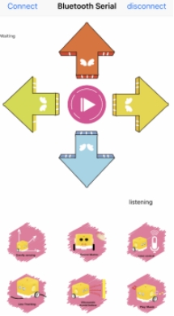

Click“Connect”to pair with Bluetooth. Then  will pop
up. Tap“Connect”again to connect to Bluetooth.

**Android System：**

Enter the following link to download App：

<https://play.google.com/store/apps/details?id=com.keyestudio.codingrobot>

**Code Explanation：**

**Serial.available():** How many characters return to buffer area. This function
is used to determine if there are data in the serial buffer area. When
Serial.available()\>0, the data is sent to the serial port.

**Serial.read():** Refers to reading a Byte of data from the buffer of the
serial port. For example, if a device sends data to the Arduino through the
serial port, we can use Serial.read() to read the sent data.

**Expansion Project：**

We can connect an LED to the yellow robot and control the LED via App.

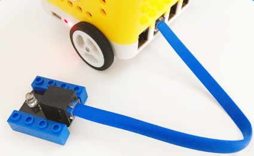

int ledpin = 12;

void setup()

{

Serial.begin(9600);

pinMode(ledpin, OUTPUT);

}

void loop()

{

int i;

if (Serial.available())

{

i = Serial.read();

Serial.println("DATA RECEIVED:");

if (i == 'B')

{

digitalWrite(ledpin, HIGH);

Serial.println("led on");

}

if (i == 'S')

{

digitalWrite(ledpin, LOW);

Serial.println("led off");

}

}

}

//\*\*\*\*\*\*\*\*\*\*\*\*\*\*\*\*\*\*\*\*\*\*\*\*\*\*\*\*\*\*\*\*\*\*\*\*\*\*\*\*\*\*\*\*\*\*\*\*\*\*\*\*\*\*\*\*\*\*\*\*\*\*\*\*\*\*\*\*\*\*\*\*\*

Upload code, click on App to control
the LED on and off

Project 13: Bluetooth Knowledge

1.  **Description：**

We’ve learned the basic knowledge of Bluetooth. And in this lesson, we will make
a Bluetooth remote smart car. In this experiment, we default the HM-10 Bluetooth
module as a Slave and the cellphone as a Host.

And we also need to install an App to control this yellow robot.

Slide the Bluetooth switch to OFF end, upload test code, slide BT switch to ON
end, then open serial monitor and set baud rate to 9600. As shown below:

Functions of App icons:

|                                 | Pairing Bluetooth                                                               |                                                                                                                                               |
|---------------------------------------------------------------------------------|---------------------------------------------------------------------------------|-----------------------------------------------------------------------------------------------------------------------------------------------|
|                                 | Enter Bluetooth control interface                                               |                                                                                                                                               |
|                                 | Disconnect Bluetooth                                                            |                                                                                                                                               |
|  | Press it to output F； Release it to output S                                   | Go forward Stop                                                                                                                               |
|    | Press it to output B； Release it to output S                                   | Go back Stop                                                                                                                                  |
|        | Press it to output L； Release it to output S                                   | Turn left Stop                                                                                                                                |
|  | Press it to output R； Release it to output S                                   | Turn right Stop                                                                                                                               |
|              | Press it to output S； Release it to output S                                   | End functions                                                                                                                                 |
|  | Press it to send Y Release it to send Y；                                       | Sound -controlled function will be activated.                                                                                                 |
| 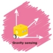         | "Waiting" label on the top left corner changes into  beating bytes              | Beating bytes means starting  device. Robot car moves in the  corresponding direction as the tilt angle of control device (cellphone) changes |
|              | Press it to output X； Release it to send X；                                   | Start line tracking function； clickto end this function                                      |
| 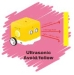             | Press it to output U； Release it to send U；                                   | Start following function clickto end this function                                            |
|              |                                                                                 |                                                                          |
|                                                                                 | 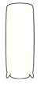 | Press it to emit “do1”， Release it to send S                                                                                                 |
|                                                                                 |                                 | Press it to emit“re1”， Release it to send S                                                                                                  |
|                                                                                 |                                 | Press it to emit“mi1”， Release it to send S                                                                                                  |
|                                                                                 |                                 | Press it to emit“fa1”， Release it to send S                                                                                                  |
|                                                                                 |                                 | Press it to emit “so”， Release it to send S                                                                                                  |
|                                                                                 |                                 | Press it to emit “la”， Release it to send S                                                                                                  |
|                                                                                 |                                 | Press it to emit“si”， Release it to send S                                                                                                   |
|                                                                                 |                                 | Press it to emit“do2”， Release it to send S                                                                                                  |
|                                                                                 |                                 | Press it to emit“re2”， Release it to send S                                                                                                  |
|                                                                                 |                                 | Press it to emit “mi2”， Release it to send S                                                                                                 |
|                                                                                 |                                 | Press it to emit“fa2”， Release it to send S                                                                                                  |
|                                                                                 |  | Send P，buzzer will play music                                                                                                                |
|                                                                                 |   | Press HMSoft to return the main page                                                                                                          |

**Preparation**

Slide the BT switch to OFF end.

Connect the yellow robot to the computer by a USB cable（3）Upload test code on
Arduino IDE.

**Test Code：**

\#include \<Matrix.h\>

volatile char val;

Matrix myMatrix(A4,A5);

void Front() {

digitalWrite(8,LOW);

pinMode(A1, OUTPUT);

digitalWrite(A1,LOW);

analogWrite(9,200);

analogWrite(10,200);

}

void Back() {

digitalWrite(8,HIGH);

pinMode(A1, OUTPUT);

digitalWrite(A1,HIGH);

analogWrite(9,194);

analogWrite(10,200);

}

uint8_t LedArray1[8]={0x18,0x18,0x18,0x18,0x99,0x5a,0x3c,0x18};

uint8_t LEDArray[8];

uint8_t LedArray2[8]={0x18,0x3c,0x5a,0x99,0x18,0x18,0x18,0x18};

uint8_t LedArray3[8]={0x08,0x04,0x02,0xff,0xff,0x02,0x04,0x08};

uint8_t LedArray4[8]={0x10,0x20,0x40,0xff,0xff,0x40,0x20,0x10};

uint8_t LedArray5[8]={0x18,0x18,0x00,0x18,0x18,0x18,0x18,0x18};

void Left() {

digitalWrite(8,LOW);

pinMode(A1, OUTPUT);

digitalWrite(A1,LOW);

analogWrite(9,120);

analogWrite(10,120);

}

void Right() {

digitalWrite(8,LOW);

pinMode(A1, OUTPUT);

digitalWrite(A1,LOW);

analogWrite(9,120);

analogWrite(10,120);

}

void Stop() {

digitalWrite(8,HIGH);

pinMode(A1, OUTPUT);

digitalWrite(A1,HIGH);

analogWrite(9,0);

analogWrite(10,0);

}

void setup(){

Serial.begin(9600);

val = 0;

myMatrix.begin(0x70);

myMatrix.clear();

myMatrix.clear();

myMatrix.writeDisplay();

pinMode(8, OUTPUT);

}

void loop(){

if (Serial.available() \> 0) {

val = Serial.read();

Serial.println(val);

}

switch (val) {

case 'F':

Front();

myMatrix.clear();

myMatrix.writeDisplay();

for(int i=0; i\<8; i++)

{

LEDArray[i]=LedArray1[i];

for(int j=7; j\>=0; j--)

{

if((LEDArray[i]&0x01)\>0)

myMatrix.drawPixel(j, i,1);

LEDArray[i] = LEDArray[i]\>\>1;

}

}

myMatrix.writeDisplay();

break;

case 'B':

Back();

myMatrix.clear();

myMatrix.writeDisplay();

for(int i=0; i\<8; i++)

{

LEDArray[i]=LedArray2[i];

for(int j=7; j\>=0; j--)

{

if((LEDArray[i]&0x01)\>0)

myMatrix.drawPixel(j, i,1);

LEDArray[i] = LEDArray[i]\>\>1;

}

}

myMatrix.writeDisplay();

break;

case 'L':

Left();

myMatrix.clear();

myMatrix.writeDisplay();

for(int i=0; i\<8; i++)

{

LEDArray[i]=LedArray3[i];

for(int j=7; j\>=0; j--)

{

if((LEDArray[i]&0x01)\>0)

myMatrix.drawPixel(j, i,1);

LEDArray[i] = LEDArray[i]\>\>1;

}

}

myMatrix.writeDisplay();

break;

case 'R':

Right();

myMatrix.clear();

myMatrix.writeDisplay();

for(int i=0; i\<8; i++)

{

LEDArray[i]=LedArray4[i];

for(int j=7; j\>=0; j--)

{

if((LEDArray[i]&0x01)\>0)

myMatrix.drawPixel(j, i,1);

LEDArray[i] = LEDArray[i]\>\>1;

}

}

myMatrix.writeDisplay();

break;

case 'S':

Stop();

myMatrix.clear();

myMatrix.writeDisplay();

for(int i=0; i\<8; i++)

{

LEDArray[i]=LedArray5[i];

for(int j=7; j\>=0; j--)

{

if((LEDArray[i]&0x01)\>0)

myMatrix.drawPixel(j, i,1);

LEDArray[i] = LEDArray[i]\>\>1;

}

}

myMatrix.writeDisplay();

break;

}

}

**Test Result**

Upload code, open switches under the yellow robot and pair with Bluetooth. Then
you can control this robot through App.

Project 14: Bluetooth Robot Car

**Description：**

In this project, we will control the yellow robot via App. You can make it
perform all functions

**Flow Chart：**

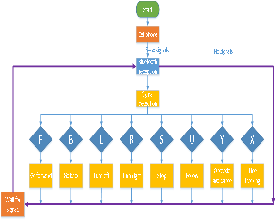

**Preparation**

-   Slide the BT switch to OFF end

-   Connect the yellow robot to the computer with a USB cable.（3）Upload test
    code on Arduino IDE

**Test Code：**

Turn off the BT switch before uploading test code

\#include \<Matrix.h\>

volatile char val;

volatile int distance1;

volatile int val_L;

volatile int val_R;

volatile int distance2;

volatile int distance3;

volatile int distance4;

volatile int sound1;

volatile int flag;

Matrix myMatrix(A4, A5);

void Front() { //go forward

digitalWrite(8,LOW); //pin 8 outputs low level

digitalWrite(A1, LOW); //A1 outputs low level

analogWrite(9,140);

analogWrite(10,140);

}

void Left() {

digitalWrite(8, LOW);

digitalWrite(A1, LOW);

analogWrite(9, 100);

analogWrite(10, 180);

}

void Left2() { //turn left

digitalWrite(8, HIGH);

digitalWrite(A1, LOW);

analogWrite(9, 120);

analogWrite(10, 120);

}

void Back() { //go back

digitalWrite(8,HIGH);

digitalWrite(A1,HIGH);

analogWrite(9,149);

analogWrite(10,150);

}

void Right() { //turn right

digitalWrite(8, LOW);

digitalWrite(A1, LOW);

analogWrite(9, 180);

analogWrite(10, 100);

}

void Right2() {

digitalWrite(8, LOW);

digitalWrite(A1, HIGH);

analogWrite(9, 120);

analogWrite(10, 120);

}

void Stop() { //stop

digitalWrite(8, HIGH);

digitalWrite(A1, HIGH);

analogWrite(9, 0);

analogWrite(10, 0);

}

uint8_t LedArray1[8] = {0x18, 0x18, 0x18, 0x18, 0x99, 0x5a, 0x3c, 0x18};

uint8_t LEDArray[8];

uint8_t LedArray2[8] = {0x18, 0x3c, 0x5a, 0x99, 0x18, 0x18, 0x18, 0x18};

uint8_t LedArray4[8] = {0x08, 0x04, 0x02, 0xff, 0xff, 0x02, 0x04, 0x08};

uint8_t LedArray3[8] = {0x10, 0x20, 0x40, 0xff, 0xff, 0x40, 0x20, 0x10};

uint8_t LedArray5[8] = {0x18, 0x18, 0x00, 0x18, 0x18, 0x18, 0x18, 0x18};

float checkdistance_2_3() { //ultrasonic ranging

digitalWrite(2, LOW);

delayMicroseconds(2);

digitalWrite(2, HIGH);

delayMicroseconds(10);

digitalWrite(2, LOW);

float distance = pulseIn(3, HIGH) / 58.00; //calculate distance

delay(10); //delay time

return distance;

}

void follow() {

flag = 0;

while (flag == 0) {

distance1 = checkdistance_2_3();

if (distance1 \> 20 && distance1 \< 40) {

Front();

} else if (distance1 \> 15 && distance1 \<= 20) {

Stop();

} else if (distance1 \> 0 && distance1 \<= 15) {

Back();

} else if (distance1 \> 40) {

Stop();

}

if (Serial.available() \> 0) {

val = Serial.read();

if (val == 'S') {

flag = 1;

}

}

}

}

void tracking() {

flag = 0;

while (flag == 0) {

val_L = digitalRead(4);

val_R = digitalRead(5);

if (val_L == 0 && val_R == 1) {

Left();

} else if (val_L == 1 && val_R == 0) {

Right();

} else if (val_L == 1 && val_R == 1) {

Stop();

} else {

Front();

}

if (Serial.available() \> 0) {

val = Serial.read();

if (val == 'S') {

flag = 1;

}

}

}

}

void avoid(){

distance4 = checkdistance_2_3();

if(distance4 \< 15&&distance4 \>0){

Stop();

Left2();

delay(380);

Stop();

distance1 = checkdistance_2_3();

delay(300);

Right2();

delay(750);

Stop();

distance2 = checkdistance_2_3();

delay(300);

if (distance1 \> distance2) {

Left2();

delay(750);

Front();

}else{

Front();

}

}

else{

Front();

}

}

void sound() {

flag = 0;

while (flag == 0) {

sound1 = analogRead(A0);

if (sound1 \> 150) {

for(int i=0;i\<10;i++){

avoid();

delay(10);

}

}

else{

Stop();

}

if (Serial.available() \> 0) {

val = Serial.read();

if (val == 'S') {

flag = 1;

}

}

}

}

void music123() {

flag = 0;

while (flag == 0) {

tone(6, 392);

delay(125);

tone(6, 392);

delay(125);

tone(6, 440);

delay(250);

tone(6, 392);

delay(250);

tone(6, 532);

delay(250);

tone(6, 494);

delay(500);

tone(6, 392);

delay(125);

tone(6, 392);

delay(125);

tone(6, 440);

delay(250);

tone(6, 392);

delay(250);

tone(6, 587);

delay(250);

tone(6, 532);

delay(500);

tone(6, 392);

delay(125);

tone(6, 392);

delay(125);

tone(6, 784);

delay(250);

tone(6, 659);

delay(250);

tone(6, 532);

delay(250);

tone(6, 494);

delay(250);

tone(6, 440);

delay(250);

tone(6, 392);

delay(125);

tone(6, 392);

delay(125);

tone(6, 330);

delay(250);

tone(6, 262);

delay(250);

tone(6, 587);

delay(250);

tone(6, 532);

delay(500);

noTone(6);

flag = 1;

val = 'S';

}

}

void setup() {

Serial.begin(9600);

val = 0;

distance1 = 0;

val_L = 0;

val_R = 0;

distance2 = 0;

distance3 = 0;

distance4 = 0;

sound1 = 0;

flag = 0;

myMatrix.begin(0x70);

myMatrix.clear();

myMatrix.clear();

myMatrix.writeDisplay();

pinMode(8, OUTPUT);

pinMode(A1, OUTPUT);

pinMode(6, OUTPUT);

pinMode(2, OUTPUT);

pinMode(3, INPUT);

pinMode(4, INPUT);

pinMode(5, INPUT);

}

void loop() {

if (Serial.available() \> 0) {

val = Serial.read();

Serial.println(val);

}

switch (val) {

case 'F':

Front();

myMatrix.clear();

myMatrix.writeDisplay();

for (int i = 0; i \< 8; i++)

{

LEDArray[i] = LedArray1[i];

for (int j = 7; j \>= 0; j--)

{

if ((LEDArray[i] & 0x01) \> 0)

myMatrix.drawPixel(j, i, 1);

LEDArray[i] = LEDArray[i] \>\> 1;

}

}

myMatrix.writeDisplay();

break;

case 'B':

Back();

myMatrix.clear();

myMatrix.writeDisplay();

for (int i = 0; i \< 8; i++)

{

LEDArray[i] = LedArray2[i];

for (int j = 7; j \>= 0; j--)

{

if ((LEDArray[i] & 0x01) \> 0)

myMatrix.drawPixel(j, i, 1);

LEDArray[i] = LEDArray[i] \>\> 1;

}

}

myMatrix.writeDisplay();

break;

case 'L':

Left();

myMatrix.clear();

myMatrix.writeDisplay();

for (int i = 0; i \< 8; i++)

{

LEDArray[i] = LedArray4[i];

for (int j = 7; j \>= 0; j--)

{

if ((LEDArray[i] & 0x01) \> 0)

myMatrix.drawPixel(j, i, 1);

LEDArray[i] = LEDArray[i] \>\> 1;

}

}

myMatrix.writeDisplay();

break;

case 'R':

Right();

myMatrix.clear();

myMatrix.writeDisplay();

for (int i = 0; i \< 8; i++)

{

LEDArray[i] = LedArray3[i];

for (int j = 7; j \>= 0; j--)

{

if ((LEDArray[i] & 0x01) \> 0)

myMatrix.drawPixel(j, i, 1);

LEDArray[i] = LEDArray[i] \>\> 1;

}

}

myMatrix.writeDisplay();

break;

case 'S':

Stop();

myMatrix.clear();

myMatrix.writeDisplay();

for (int i = 0; i \< 8; i++)

{

LEDArray[i] = LedArray5[i];

for (int j = 7; j \>= 0; j--)

{

if ((LEDArray[i] & 0x01) \> 0)

myMatrix.drawPixel(j, i, 1);

LEDArray[i] = LEDArray[i] \>\> 1;

}

}

myMatrix.writeDisplay();

noTone(6);

break;

case 'U':

follow();

break;

case 'X':

tracking();

break;

case 'Y':

sound();

break;

case '1':

tone(6, 262);

break;

case '2':

tone(6, 294);

break;

case '3':

tone(6, 330);

break;

case '4':

tone(6, 349);

break;

case '5':

tone(6, 392);

break;

case '6':

tone(6, 440);

break;

case '7':

tone(6, 494);

break;

case '8':

tone(6, 532);

break;

case 'G':

tone(6, 587);

break;

case 'H':

tone(6, 659);

break;

case 'J':

tone(6, 698);

break;

case 'P':

music123();

break;

}

}

**Test Result：**

Upload code, open switches under the yellow robot and pair with Bluetooth. Then
you can control this robot through App.

# 

1.  **Resource:**

**Download code, libraries and Arduino IDE:**

<https://kd.kidsbits.cc/KD0003>
