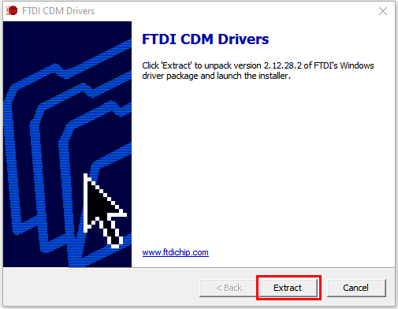
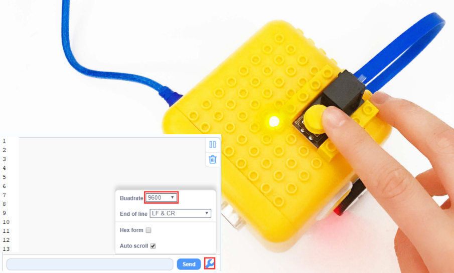
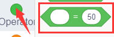
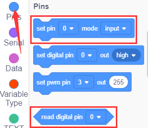
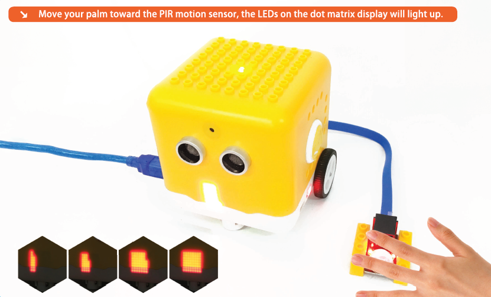
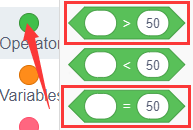

# Kidsblock tutorial

##  Getting started with kidsblock

**Instruction**

The Kidsblock, based on the Scratch graphical programming software, integrates multiple mainstream mainboards, sensors as well as modules. It can be programmed by dragging graphical blocks and using the C/C++ programming language, making programming easy and interesting for children to learn.

**Download and install KidsBlock software**

**[Windows system](https://www.kidsblock.cn/Down/KidsBlock.exe)**

**[MACOS system](https://www.kidsblock.cn/Down/KidsBlock-MACOS.dmg)**

**How to use KidsBlock**

**Interface**

Clickto switch to different languages

**Install driver**

Clickto select“**Install driver**”.

Note: If the driver is not installed, as shown below;

Click “Next” at the **Device Driver Installation Wizard** page.

After a while, click“Finish”

Then click“Next”.

And click“Finish”.

Then click“**Allow**”and“**Install**”

After a while，click“Finish”

Select“Extract”

Click“**Next**”

Next, click“**I accept this agreement**”and“**Next**”

Click“Finish”.

After a while, click“**INSTALL”**

After a few seconds, when the driver is installed, just click“**OK**”

Click  to enter the main page, select the control board needed. In this project, we select“**CodingRobot**”and click **Connect,** then it is connected.

Click **Go to Editor** to return the code editor.

Icon  will change into  and will change into . This means the **CodingRobot** and ports（COM）are connected.

If the“**CodingRobot**” is connected , but icon doesn’t change into . You need to click to connect the COM port.

Click  and **Connect.**

Then you will find a page pop up, showing **Connected.**

To disconnect the port, just click  and **Disconnect**

Note: if you want to update libraries of KidsBlock, click  then Clear cache and restart

**How to open SB3 type files**

Double-click SB3 type files to open them.

For instance, open , then we need to double-click .

Open Kidsblock，click **file and Load from your computer**，then select the SB3 type file on the computer.（for example ）

## Projects

### Project 01: Blinking LED

**Introduction：**

For starters and enthusiasts, LED Blink is a fundamental program.

LED, the abbreviation of light emitting diodes, consists of Ga, As, P, N chemical compound and so on. The LED can flash diverse color by altering the delay time in the test code.

In the circuit, power on GND and VCC, the LED will be on if S end is high level; nevertheless, it will go off.

In the experiment, we make the LED module blink through the test code.

**Specification：**

-   Control interface: digital port
-   Working voltage: DC 3.3-5V
-   Port: EASY plug
-   LED display color: seven colors
**Connection Diagram**

This Kidsbits programming blocks LED module is compatible with LEGO blocks and the yellow robot. To wire up easily, we adapt the EASY plug to hinder the reverse wiring-up. As shown below, we connect the LED module to the digital port 12(D12)

**Test Code**

Turn off the Bluetooth switch before uploading the code.

Look for Code Blocks

You can drag blocks to edit. Blocks listed below are for your reference

Complete Program

**Project Result**

Slide the Bluetooth switch to OFF end, clickto upload the code to the yellow robot successfully, the LED connected to D12 blinks circularly, with an interval of 500ms.

### Project 02: Playing Music

**Introduction：**

We can use Arduino to make many interactive works, of which the most commonly used is acoustic-optic display.

The buzzer we introduced here is a passive buzzer. It cannot be actuated by itself, but by external pulse frequencies. The passive buzzer doesn’t carry with vibrator inside, so it need external sine or square wave to drive. It can produce slight sound when connecting directly to power supply. It features controlling sound frequency and producing the sound of“do re mi fa so la si”.Finally, let the buzzer play a specific song.

**Passive Buzzer：**

**Advantages：**
-   Low cost
-   the sound frequency is high
-   In some experiments, passive buzzer and LED can use a IO port jointly.
**How to use passive buzzer**

Passive buzzer is controlled by PWM pulse width rather than tones.

PWM is a means of controlling the analog output via digital means. Digital control is used to generate square waves with different duty cycles (a signal that constantly switches between high and low levels) to control the analog output.In general, the input voltages of ports are 0V and 5V.

In the above figure, the green line represents a period, and value of analogWrite() corresponds to a percentage which is called Duty Cycle as well. Duty cycle implies that high-level duration is divided by low-level duration in a cycle. From top to bottom, the duty cycle of first square wave is 0% and its corresponding value is 0. The LED brightness is lowest, that is, light off. The more time the high level lasts, the brighter the LED.

Therefore, the last duty cycle is 100%, which correspond to 255, and LED is the brightest. And 25% means darker. PWM mostly is used for adjusting the LED’s brightness or the rotation speed of motors or the frequency of passive buzzer.

Beats are the time delay for each note. The larger the number, the longer the delay time. A note without a line in the spectrum is a beat, with a delay of 1000 milliseconds. while a beat with an underline is 1/2 of a beat without a line, and a beat with two underlines is 1/4 of a beat without a line.

**Preparation:**
Slide the Bluetooth switch under the yellow robot to OFF end
Interface the yellow robot with a computer via a USB cable.
**Test Code1：**

Turn off the Bluetooth switch before uploading the code.

Look for Code Blocks

You can drag blocks to edit. Blocks listed below are for your reference

Complete Program

**Project Result1**

Slide the Bluetooth switch to OFF end, clickto upload the code to the yellow robot successfully, you will hear the sound of“do re mi fa so la si”

**Test Code2：**

Turn off the Bluetooth switch before uploading the code.

Look for Code Blocks

You can drag blocks to edit. Blocks listed below are for your reference

Complete Program

**Project Result2**

Slide the Bluetooth switch to OFF end, clickto upload the code to the yellow robot successfully, you will hear the Ode to Joy song.

### Project 03: Birthday Gift

**Introduction：**

Under the weak light，the yellow robot will play a birthday song and blink its LED; however, it won’t play music and blink its LED under the strong light. Light and music can vary with light intensity! In this project, we particularly introduce the photoresistor module.

**Photoresistor**

This photoresistor sensor integrates the LEGO building block and Easy Plug port, which can be fixed on the yellow robot flexibly. Only a blue cable needed can interface it with the yellow robot. You are free from worries over reversely wire up or damaging the module

This sensor is most sensitive to ambient light, generally used to detect the brightness of the ambient light and trigger a single-chip or relay module, etc.

It mainly uses photoresistive elements and changes with light intensity. Under the strong light, the resistance is 5-10KΩ; if there is no bright light, the resistance is 0.2MΩ.

**Parameter：**

Port：EASY plug

Working Voltage：DC 5V

Output Signal：Analog signal

**Components：**

| Kidsbits Yellow  Robot \*1                               | Kidsbits Building Block LED Module \*1          | Kidsbits Building Block Photoresistor\*1        |
|----------------------------------------------------------|-------------------------------------------------|-------------------------------------------------|
|  |  |  |

When the ambient light is weak, LED will flash and the yellow robot will play songs.

When the ambient light is strong, LED will be off and the robot won’t play music.

And we need to detect the ambient light firstly. According to the detected result, the light intensity value is between 700 and 750. Then we will continue to measure.

When light intensity is between 700 and 750. When covering the photoresistor, the detected value gets small. If the value is less than 700, robot will play music.

If you the intensity is not less than 700, LED will be off and robot won’t play music.

**Connection Diagram：**

Note: the LED module is interfaced with D12 and the photoresistor module is connected to A6 port.

**Preparation:**
Slide the Bluetooth switch under the yellow robot to OFF end
Interface the yellow robot with a computer via a USB cable.
**Test Code：**

Turn off the Bluetooth switch before uploading the code.

Look for Code Blocks

You can drag blocks to edit. Blocks listed below are for your reference

Complete Program

**Project Result**

Slide the Bluetooth switch to OFF end, clickto upload the code to the yellow robot successfully, the robot will blink its LED and play song; however, under the strong light, it won’t take a reaction.

### Project 04: Distance Detector

**Description：**

You may find that when we reverse a car, the alarm system will be triggered if the car is going to hit the obstacle behind. This is because the car has installed a safety device, the reversing radar which can detect the distance between the car and objects behind.

In this lesson, we will learn how to make such a distance measuring device with an ultrasonic sensor and a buzzer. Since we have illustrated buzzer in previous project, here we will focus on the ultrasonic sensor.

**Ultrasonic Module**

An ultrasonic sensor uses a sonar to determine the distance from the object like what bats do. And it boasts a complete transmitting module and a receiving module.

Thus it can provide a non-contact distance measurement with high accuracy and stable readings.

Ultrasonic sensors have found wide applications in all sorts of electronic projects, such as obstacle detection and distance measurement. This project will concentrate on how to use the ultrasonic sensor to detect distance.

**Working principle：**

The ultrasonic sensor is shaped like two eyes, of which one serves as the transmitting end and the other the receiving end.

It detects the time (t) gap between emitting signals and receiving them. And the propagation speed of sound in the air is about 343m/s, and distance = speed \* time. However, the ultrasonic wave emits and comes back, which is 2 times of distance. Therefore, it needs to be divided by 2, the distance measured by ultrasonic wave = (speed \* time)/2.

Usage and timing chart of ultrasonic module:
Setting the delay time of Trig pin of SR04 to 10μs at least, which can trigger it to detect distance.
After triggering, the module will automatically send eight 40KHz ultrasonic pulses and detect whether there is a signal return. This step will be completed automatically by the module.
If the signal returns, the Echo pin will output a high level, and the duration of the high level is the time from the transmission of the ultrasonic wave to the return.

 

**Parameters：**

Power supply: +5V DC

Quiescent current: \<2mA

Working current: 15mA

Effective angle: \<15°

Measuring distance: 2 cm to 40 cm

Resolution: 0.3 cm

Measuring angle: 30 degrees

Trigger input pulse width: 10uS

**Preparations**

A.Turn the Bluetooth dial switch to OFF .

B.Connect the yellow car and the computer via a USB cable.

**Test Code：**

Turn off the Bluetooth switch before uploading the code.

Look for Code Blocks

You can drag blocks to edit. Blocks listed below are for your reference

Complete Program 

**Project Result**

Slide the Bluetooth switch to OFF end, clickto upload the code to the yellow robot successfully, the yellow robot will emit“tick,tick”when detecting the obstacle away from 0cm to 8cm.

### Project 05: Button Counter

**Description：**

In daily life, we usually need to count numbers. In this project, we will make a button counter.

**Button Module：**

This button module integrates the LEGO building block and Easy Plug port, which can be fixed on the yellow robot flexibly. Only a blue cable needed can interface it with the yellow robot. You are free from worries over reversely wire up or damaging the module

When we press it, low level signals will be output; when it is released, high level signals will be output

**Parameter：**

Interface: EASY plug

Working voltage: DC 5V

Output signal: digital signal

**Connection Diagram：**

Use the blue cable to connect the button module to D12 port of the yellow robot

**Preparation：**

Slide the BT switch to OFF end

Connect the yellow robot to the computer by a USB cable

Connect the button module to D12 through a blue cable

**Test Code：**

Turn off the Bluetooth switch before uploading the code.

Look for Code Blocks

You can drag blocks to edit. Blocks listed below are for your reference

Complete Program

**Project Result**

Slide the Bluetooth switch to OFF end, clickto upload the code to the yellow robot successfully, then tap  to set the baud rate to 9600，and press the button. You will see the data as follows:

**Code Explanation:**

When you press or release button, different digital signals will be output due to the shaking of the button. To eliminate shaking, we need to delay time. In this chapter, we delay in 10ms.

### Project 06: Motor

**Introduction:**

DC reduction motor, also called gear reduction motor, is developed on the ordinary DC motor. It has a matching gear reduction box which provides a lower speed but a larger torque. Furthermore, different reduction ratios of the box can provide different speeds and torques.

**Parameters:**

Rated voltage: 6.0V DC

Operating voltage: 1.0V \~ 6.0V DC

Rated load: torque plate load 0.5kg-cm

Rotation direction: clockwise or counterclockwise when viewed from the shaft extension

Motor posture: all directions of output shaft

Operating temperature: -10℃\~+60℃

Storage temperature: -20℃\~+85℃

**Description of chip:**

A motor driver is a chip integrated with CMOS control circuit and power DMOS device. It can be used to form a complete motion control system with the main processor, motor and incremental encoder. It can be applied to drive inductive loads such as DC motors, stepping motors and relays. What’s more, it can control the DC reduction motor to rotate clockwise or anticlockwise.

The yellow car introduced in this course uses the TB6612FNG motor drive chip, which is a device driving DC motors. Compared with the traditional L298N, the module has a much higher efficiency and a significant reduction in size. Within the rated range, the chip basically does not generate heat.

It has a high-current MOSFET-H bridge structure and dual-channel circuit output, so it can drive 2 motors at the same time. TB6612FNG can output continuous drive current up to 1.2 A per channel, and it boasts four motor control modes: rotate clockwise, rotate anticlockwise, brake and stop.

**Working Principle**

The DC reduction motor on the left side of the yellow car has two pins which are connected to the digital pin 8 and pin 9 (a PMW pin)controlling the rotation direction and the speed respectively.(This PMW pin can not only output high and low level stably but make constant changes in high and low levels within a given time so as to control the speed of the motor. It can output values from 0-255 of which 255 represents high level while 0 implies low level.)

| Its Left Wheel |                      |                      |
|----------------|----------------------|----------------------|
| Digital Pin 8  | Digital Pin 9（PWM） | DC Reduction Motor   |
| Low Level      | 0                    | Stop                 |
| Low Level      | 200                  | Rotate anticlockwise |
| High Level     | 200                  | Rotate clockwise     |
| High Level     | 0                    | Stop                 |

The DC reduction motor on the right side of the car also has two pins, one of which is connected to the analog pin A1 (also the digital pin 15) to control directions and the other is linked with digital pin 10 to adjust speed. Please note that analog pins can function like digital pins while digital pins can not be taken as analog ones.

| Its Right Wheel |                       |                      |
|-----------------|-----------------------|----------------------|
| Digital Pin A1  | Digital Pin 10（PWM） | DC Reduction Motor   |
| Low Level       | 0                     | Stop                 |
| Low Level       | 200                   | Rotate clockwise     |
| High Level      | 200                   | Rotate anticlockwise |
| High Level      | 0                     | Stop                 |

**Test Code：**

Turn off the Bluetooth switch before uploading the code.

Look for Code Blocks

You can drag blocks to edit. Blocks listed below are for your reference

Complete Program

Theoretically, the PWM values of the left and right motors are the same, however, to make the yellow car go straight, sometimes the values of the motors are slightly different due to the hardware of the motors.

**Project Result**

Slide the Bluetooth switch to OFF end,,clickto upload the code to the yellow robot successfully, slide the power switch to ON end. The car will move forward in 3s, then go backwards in 3s, stop in 3s, and turn left in 3s and then right in 3s and repeat this pattern.

### Project 07: 8*8 Dot Matrix Dispaly

**Description：**

We add an LED panel displaying numerous pictures to a robot. In fact, this panel is called 8\*8 dot matrix display. It comes with 64 LEDs, of which can be lit separately or together. Different lit areas can foster distinct pictures.

**8\*8 Dot Matrix:**

****

Composed of LED emitting tube diodes, LED dot matrix are applied widely to public information display like advertisement screen and bulletin board, by controlling LED to show words, pictures and videos, etc.

Divided into single-color, double-color, and three-color lights according to emitting color , LED dot matrix could show red, yellow, green and even true color.

There are different types of matrices, including 4×4, 8×8 and 16×16 and etc.

The 8×8 dot matrix contains 64 LEDs.

The inner structure of 8×8 dot matrix is shown below.

Every LED is installed on the cross point of row line and column line. When the voltage on a row line increases, and the voltage on the column line reduces, the LED on the cross point will light up. 8×8 dot matrix has 16 pins. Put the silk-screened side down and the numbers are 1,8, 9 and 16 in anticlockwise order as marked below.

The definition inner pins are shown below:

For instance, to light up the LED on row 1 and column 1, you should increase the voltage of pin 9 and reduce the voltage of pin 13.

**HT16K33 8X8 Dot Matrix**

The HT16K33 is a memory mapping and multi-purpose LED controller driver. The max. Display segment numbers in the device is 128 patterns (16 segments and 8 commons) with a 13\*3 (MAX.) matrix key scan circuit. The software configuration features of the HT16K33 makes it suitable for multiple LED applications including LED modules and display subsystems. The HT16K33 is compatible with most microcontrollers and communicates via a two-line bidirectional I2C-bus.

The picture below is the working schematic of HT16K33 chip

We design the drive module of 8\*8 dot matrix based on the above principle. We could control the dot matrix by I2C communication and two pins of microcontroller, according to the above diagram.

**Specification of 8\*8 dot matrix**

Input voltage: 5V

Rated input frequency: 400KHZ

Input power: 2.5W

Input current: 500mA

**Preparation:**

Slide the BT switch to OFF end

Connect the yellow robot to the computer by a USB cable

**Test Code1：**

Turn off the Bluetooth switch before uploading the code.

Look for Code Blocks

You can drag blocks to edit. Blocks listed below are for your reference

Complete Program

**Project Result1**

Clickto upload the code to the yellow robot successfully, the yellow robot displays smile image

**Test Code2：**

Turn off the Bluetooth switch before uploading the code.

Look for Code Blocks

You can drag blocks to edit. Blocks listed below are for your reference

（1）

（2）

（3）

Complete Program

**Project Result2**

Slide the Bluetooth switch to OFF end, clickto upload the code to the yellow robot successfully, the yellow robot will show arrow up,down, leftward and rightward and ❤ image, circularly.

### Project 08: Obstacle Avoidance Robot

**Description：**

We have learned about distance detection and motor drive. In this lesson, we combine them together. In fact, we only need to change a test code to convert the car into an obstacle avoidance car.

| detection       | Distance away from the left obstacle  | Distance1（unit：cm） |
|-----------------|---------------------------------------|-----------------------|
|                 | Distance away from the right obstacle | Distance2（unit：cm） |
|                 | Distance away from the front obstacle | distance（unit：cm）  |
| Condition       | Status                                |                       |
| 0\<distance\<15 | distance1\> distance2                 | Turn left             |
|                 | distance1\<=distance2                 | Turn right            |
| distance\>=15   | Go forward                            |                       |

**Preparation:**

Slide the BT switch to OFF end

Connect the yellow robot to the computer by a USB cable

**Test Code：**

Turn off the Bluetooth switch before uploading the code.

Pin Trig (trigger signal input) and pin Echo are connected to digital 2 and 3 of the yellow robot.

**Project Result**

Slide the Bluetooth switch to OFF end, clickto upload the code to the yellow robot successfully,slide the power switch to ON end. If the obstacle distance is more than and equal to 15cm, the car will go forward. If less than 15cm, the car will stop and play "tick,tick" sound. If the left obstacle distance is greater than the right distance, the car will turn left. On the contrary, it will turn right.

### Project 09: Line Tracking Smart Car

**Description**

The previous projects are inclusive of the knowledge of multiple sensors and modules. Next, we will work on a little challenging task.

Based on the working principle of the line tracking sensor we could make a line tracking car.

The tracking sensor is actually an infrared sensor. Its working principle is to convert the intensity of the reflected signal into a current signal. During the detection process, black color is active at high level and white is active at low level. Its detection height is 0- 1cm. In the project, we detect the status of the tracking sensor, then analyze and compare the data obtained, and then control the rotation of the two sets of motors according to certain logic, so as to control the yellow robot.

**Flow Chart：**

| Detection                                                               | Left tracking sensor        | detects black line：LOW  |
|-------------------------------------------------------------------------|-----------------------------|--------------------------|
|                                                                         |                             | detects white line：HIGH |
|                                                                         | Right tracking sensor       | detects black line：LOW  |
|                                                                         |                             | detects white line：HIGH |
| Condition                                                               | Status                      |                          |
| Two sensors detect black line                                           | Go forward                  |                          |
| Left sensor detects white line and right one detects the black line     | Turn right (set PWM to 100) |                          |
| left sensor detects the black line and the right one detects white line | Turn left (set PWM to100)   |                          |
| Two sensors don’t black line                                            | Stop                        |                          |

**Preparation**

Slide the BT switch to OFF end

Connect the yellow robot to the computer by a USB cable

**Test Code：**

Turn off the Bluetooth switch before uploading the code.

Theoretically, the PWM values of the left and right motors are the same, both of which are 100. However, due to the hardware of the motors, to make the yellow car run stably, the values of the left and right motors are slightly different according to the actual situation.

**Project Result**

Slide the Bluetooth switch to OFF end, clickto upload the code to the yellow robot successfully, slide the power switch to ON end. Then the yellow robot will follow the black line.

### Project 10: Magical Pattern

**Description：**

We’ve introduced how to use the LED dot matrix and change pictures. In this project, we will make dot matrix show different images through a PIR motion sensor.

**PIR Motion Sensor：**

This PIR motion sensor integrates the LEGO building block and Easy Plug port, which can be fixed on the yellow robot flexibly. Only a blue cable needed can interface it with the yellow robot. You are free from worries over reversely wire up or damaging the module.

It can detect infrared signals of people or animals in motion, and output switch signals. It also is highly sensitive and reliable with ultra-low power consumption and ultra-low voltage working mode.

Additionally it can be applied to various automatic induction electrical equipment, especially automatic control products powered by dry batteries.

**Parameter:**

Interface: EASY plug

Working voltage: DC 3.3V\~5V

Working current: 15 uA

Output signal: digital signal

Output delay time (high level): about 2.3 \~ 3 seconds

Detection range: 0\~50cm

Detection angle: 100º.

**Special note：**

1\. When testing, first open the white lens, you can see the rectangular sensing part. When the long line of the rectangular sensing part is parallel to the ground, the distance is the best.

2\. When testing, the sensor needs to be covered with white lens, otherwise it will affect the distance.

3\. The distance is best at 25℃, and the detection distance is shortened when it exceeds 30℃.

4\. Done powering up and uploading the code, you need to wait 5-10 seconds then start testing, otherwise it is not sensitive.

**Connection Diagram：**

Connect the PIR motion sensor to D12 of the yellow robot

**Preparation**

Slide the BT switch to OFF end

Connect the yellow robot to the computer by a USB cable

Connect the PIR motion sensor to D12 of the yellow robot

**Test Code：**

Turn off the Bluetooth switch before uploading the code.

**Project Result**

Clickto upload the code to the yellow robot successfully,the yellow robot will display multiple patterns when detecting people around. If nobody is nearby, it will convert from a big square into a smaller one, circularly.

### Project 11: Sound-controlled Smart Car

**Description**

In this project，we will make a yellow robot perform sound control function through sound sensor and ultrasonic sensor inside.

**Sound Sensor**

The sound sensor is a sensor that converts sound signals into electrical signals. It can be used to make sound-activated robots, sound-activated switches, sound-activated alarms, etc., according to the effect of interacting with the sound.

There is a very thin film in the sensor. When sound or air blows it,

the sound wave or airflow passes through, the film will vibrate continuously and generate an electrical signal, which is transmitted to the coding robot. (Arduino Uno)

The sound intensity detected can be converted to any value between 0\~1023. The Trig pin of the ultrasonic sensor is connected to digital 2 and Echo pin is connected to digital 3. The sound sensor is interfaced with analog A0, SDA and SCL pin of dot matrix display is attached to analog A4 and A5. The pin controls direction on the left DC geared motor is connected to digital 8 and its pin controlling speed is interfaced with digital 9.

The pin controlling direction on the right DC motor is attached to A1(digital 15) and the pin controlling speed is interfaced with digital 10.

**Preparation**

Slide the BT switch to OFF end

Connect the yellow robot to the computer by a USB cable

**Test Code**

Turn off the Bluetooth switch before uploading the code.

Note: Fully charge the yellow robot if you continue further experiments. Clap your hands or make sounds with 5cm away from sound sensor.

**Project Result**

Slide the Bluetooth switch to OFF end, clickto upload the code to the yellow robot successfully, slide the power switch to ON end. When the sound intensity is more than 150, the yellow robot will activate obstacle avoidance; when the sound intensity is less than 150, the robot will stop.

### Project 12: Bluetooth Knowledge

**Description：**

Bluetooth wireless communication module has spread over in electronic sector. The Bluetooth standard has upgraded continuously so as to meet the needs of customers and technology.

Over the years, data transfer rates, power consumption of wearable devices and IoT devices, and security systems have promoted.

**Parameter：**

Working distance: In an open environment, achieve 30\~50cm ultra-long-distance communication.

Working frequency: 2.4GHz ISM band

Modulation method: GFSK (Gaussian Frequency Shift Keying)

Transmission power: -23dbm, -6dbm, 0dbm, 6dbm, which can be modified by AT command

Sensitivity: ≤-84dBm at 0.1%BER

Transmission rate: 6K bytes

Security features: authentication and encryption

Support services: central and peripheral UUID FFE0, FFE1

Power consumption: automatic sleep mode

Standby current 400uA\~800uA, 8.5mA during transmission

Power supply: 5V DC

Operating temperature: -5 to +50 degrees Celsius

**Preparation:**
-   Slide the BT switch to OFF end.
-   Connect the yellow robot to the computer by a USB cable
**Test Code：**

Turn off the Bluetooth switch before uploading the code.

Look for Code Blocks

You can drag blocks to edit. Blocks listed below are for your reference

Look for Code Blocks

**Download APP：**

iOS system

Enter **App store** and search **Coding Robot**

Download and open it.

Coding Robot App:

**Android System：**

Enter the following link to download App：

<https://play.google.com/store/apps/details?id=com.keyestudio.codingrobot>

**Project Result**

Slide the Bluetooth switch to OFF end, clickto upload the code to the yellow robot successfully. Tap  to set the baud rate to 9600, then slide the Bluetooth switch and the power switch to ON end.

Click“Connect”to pair with Bluetooth. Then  will pop up. Tap“Connect”again to connect to Bluetooth.

Click each pattern button on the APP and wait for the command from cellphone, As shown below:

### Project 13: Bluetooth Remote Control

**Description：**

We’ve learned the basic knowledge of Bluetooth. In this lesson, we will use APP and Bluetooth to control the LED on and off.

In this experiment, we default the HM-10 Bluetooth module as a Slave and the cellphone as a Host.

And we also need to install an App to control this yellow robot.

**Functions of App icons:**

|  | Pairing Bluetooth                                                  |                                                                                                                                               |
|----------------------------------------------------------------------------------|--------------------------------------------------------------------|-----------------------------------------------------------------------------------------------------------------------------------------------|
|  | Enter Bluetooth control interface                                  |                                                                                                                                               |
|  | Disconnect Bluetooth                                               |                                                                                                                                               |
|                                   | Press it to output F； Release it to output S                      | Go forward Stop                                                                                                                               |
|                                   | Press it to output B； Release it to output S                      | Go back Stop                                                                                                                                  |
|                                   | Press it to output L； Release it to output S                      | Turn left Stop                                                                                                                                |
|                                   | Press it to output R； Release it to output S                      | Turn right Stop                                                                                                                               |
|                                   | Press it to output S； Release it to output S                      | End functions                                                                                                                                 |
|                                   | Press it to send Y Release it to send Y；                          | Sound -controlled function will be activated.                                                                                                 |
|                                   | "Waiting" label on the top left corner changes into beating bytes | Beating bytes means starting  device.  |
|                                   | Press it to output X； Release it to send X；                      | Start line tracking function； clickto end                                       |
|                                   | Press it to output U； Release it to send U；                      | Start following function； clickto end                                             |
|                                   |                                                                    |                                                                                                |
|                                                                                  |                     | Press it to emit “do1”， Release it to send S                                                                                                 |
|                                                                                  |                     | Press it to emit“re1”， Release it to send S                                                                                                  |
|                                                                                  |                     | Press it to emit“mi1”， Release it to send S                                                                                                  |
|                                                                                  |                     | Press it to emit“fa1”， Release it to send S                                                                                                  |
|                                                                                  |                     | Press it to emit “so”， Release it to send S                                                                                                  |
|                                                                                  |                     | Press it to emit “la”， Release it to send S                                                                                                  |
|                                                                                  |                     | Press it to emit“si”， Release it to send S                                                                                                   |
|                                                                                  |                     | Press it to emit“do2”， Release it to send S                                                                                                  |
|                                                                                  |                     | Press it to emit“re2”， Release it to send S                                                                                                  |
|                                                                                  |                     | Press it to emit “mi2”， Release it to send S                                                                                                 |
|                                                                                  |                     | Press it to emit“fa2”， Release it to send S                                                                                                  |
|                                                                                  |                     | Send P，buzzer will play music                                                                                                                |
|                                                                                  |                     | Press HMSoft to return the main page                                                                                                          |

**Preparation**

（1）Slide the BT switch to OFF end.

（2）Connect the yellow robot to the computer by a USB cable

（3）We can connect an LED to the yellow robot and control the LED via App，As shown below, we connect the LED module to the digital port 12(D12)

**Test Code：**

Turn off the Bluetooth switch before uploading the code.

Look for Code Blocks

You can drag blocks to edit. Blocks listed below are for your reference

Complete Program

**Project Result**

Slide the Bluetooth switch to OFF end, clickto upload the code to the yellow robot successfully. Tap  to set the baud rate to 9600，then slide the Bluetooth switch and power switch under the yellow car to the ON end.

Click“Connect”to pair with Bluetooth. Then  will pop up. Tap“Connect”again to connect to Bluetooth.

click on App to control the LED on and off，As shown below:

### Project 14: Bluetooth Robot Car

**Description：**

In this project, we will control the yellow robot via App. You can make it perform all functions

**Flow Chart：**
**Preparation:**

Slide the BT switch to OFF end

Connect the yellow robot to the computer with a USB cable.

**Test Code：**

Turn off the Bluetooth switch before uploading the code.

Complete Program

**Project Result**

Slide the Bluetooth switch to OFF end, clickto upload the code to the yellow robot successfully. Then slide the Bluetooth switch and the power switch under the yellow car to the ON end and match the Bluetooth, you can control this robot through the App.

**Code Explanation**

Characters can be converted to numbers through the ASCII code.

Here are the numbers and characters on the keyboard that correspond to the ASCII code.

The ASCII value 49 here is the character '1'；The ASCII value 50 is the character‘2’.
