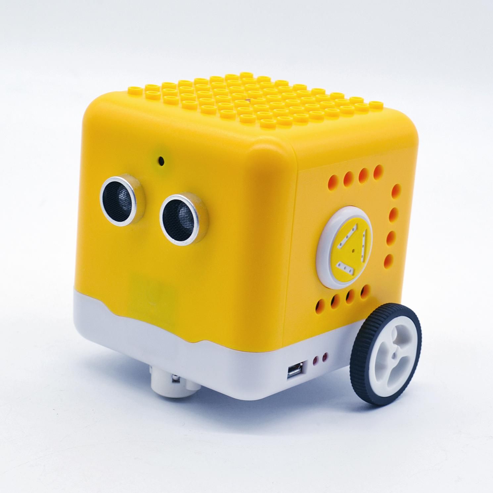
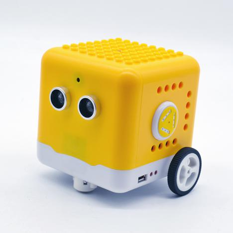
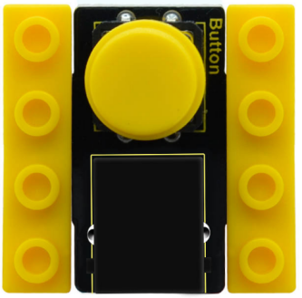
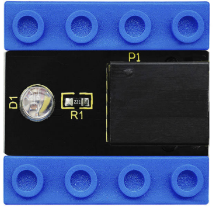
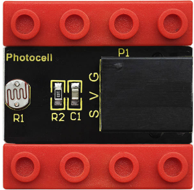
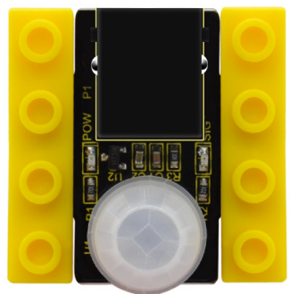
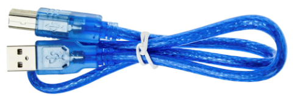
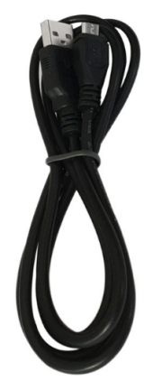
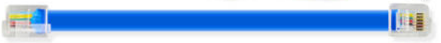

# **kidsbits Coding Robot for STEM**

## **Description**

kidsbits rolls out a Kidsbits yellow car, aiming at cultivating children’s hands-on logical analysis, creativity and problem solving ability by learning practical knowledge about electronics, mechanics, control logic and computer science.

The shell of this car is modeled after building blocks. This robot is compatible with Lego bricks，which can substantially foster numerous experiments.

Additionally, it is equipped with two passive buzzers to play music and an LED display to show the pattern to your taste.

The LED display can be combined with ultrasonic modules, which can be regarded as two eyes to make it more interesting. Furthermore, it is chargeable.

This tutorial is designed to stimulate children's interest in programming and microcontrollers. From download, installation and usage of software to the 14 projects, children can learn to program to control the yellow robot.

It adopts eco-friendly ABS757 material. As one of the synthetic resins, ABS composite has the advantages of heat-resistant, anti-chemical and low temperature resistance. It is widely applied to industrial fields such as machinery, automobiles, electronic appliances, instrumentation, textiles and construction.

  **Precaution:**

-   No sharp angles and smooth surface, easy to handle and control.
-   Sturdy strong structure,without tiny parts and risk of choking
-   Complete car body, no crack, no potential dangers for kids.
-   With plastic structure, safe and reliable.

## **Features**

-   No need to install and wire: an integrated design; the control board integrates functions such as ultrasonic, line tracking, LED display, etc.
-   Multiple functions: play music, display patterns, BT control, obstacle avoidance, line tracking and others.
-   High Tenacity: high quality metal motors
-   High extension: its rear is equipped with 4 sensor expansion ports; its body adopts a building block design and it is compatible with Lego bricks too, which makes it convenient for the car to connect with other modules and sensors.
-   Multiple controls: IR remote control, App control (iOS and Android system)
-   Basic programming：C language code of Arduino IDE, Mixly graphical programming and Scratch graphical programming

## **Parameters**

-   Working voltage: 5V
-   Battery: 14500 lithium battery 700MAH 3.7V
-   Power supply: power via USB cable or battery
-   Dimensions (including wheels): 92mm*105mm*95mm
-   N20 motor speed: 5V 200 rpm
-   Bluetooth APP control: support both Android and IOS system
-   Working temperature: 0-50℃

## **Kit List**

| No | Product Name                         | QTY | Picture                                                  |
|----|--------------------------------------|-----|----------------------------------------------------------|
| 1  | Kidsbits Yellow Robot                | 1   |  |
| 2  | Kidsbits Push Button Module          | 1   |           |
| 3  | Kidsbits 7-color Flashing LED Module | 1   |           |
| 4  | Kidsbits Photoresistor               | 1   |           |
| 5  | Kidsbits PIR Motion Sensor           | 1   |           |
| 6  | AM/BM Blue USB Cable                 | 1   |           |
| 7  | AM/MK5P Black USB Cable              | 1   |           |
| 8  | 200mm Blue RJ11 Cable                | 4   |           |

